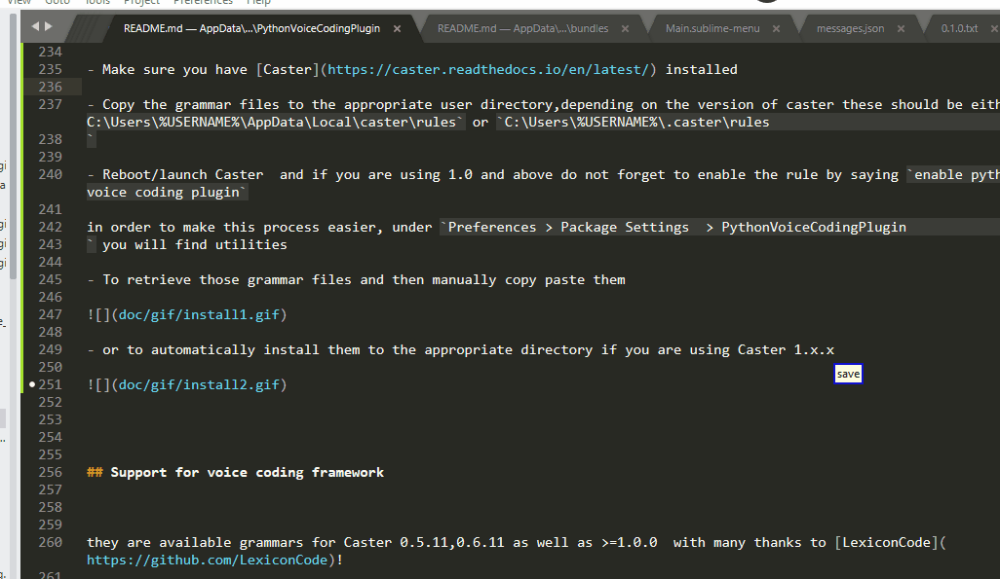
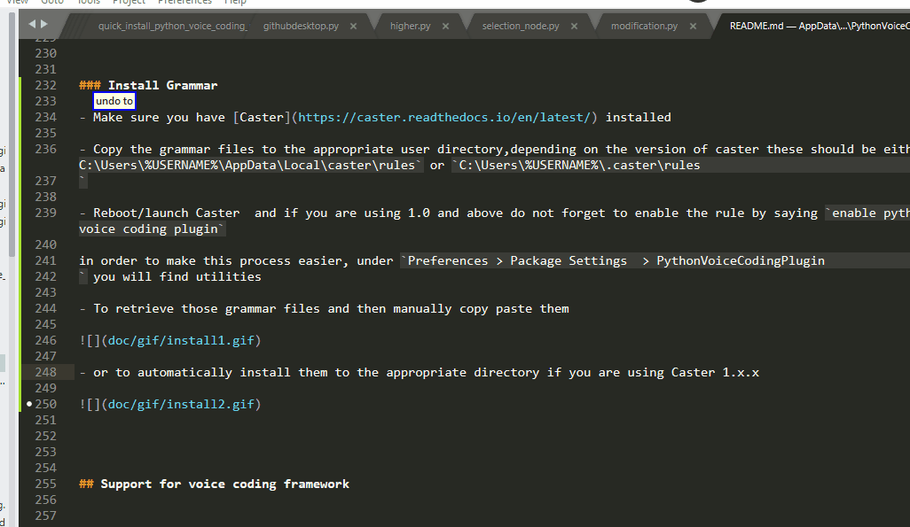

# PythonVoiceCodingPlugin

[](https://opensource.org/licenses/BSD-2-Clause)


[](https://github.com/dictation-toolbox/Caster)
[](https://github.com/dictation-toolbox/aenea)


[](https://gitter.im/PythonVoiceCodingPlugin/community)
[](https://pythonvoicecodingplugin.readthedocs.io/en/latest/)

***PythonVoiceCodingPlugin*** is a Sublime Text 3 plugin meant to provide ***syntactical navigation capabilities*** for Python coders that are ***programming by voice*** , focusing on those who use it ***by need*** but also targeting those who simply desire ***an enhancement to their workflow*** . Users can describe  what region they want to select/operate on with ***naturally sounding voice commands*** such as 

`delete right`, `copy argument 3`, `paste part 4` , `down 2 functions second if condition`,`swap red with blue`

allowing for a ***foster,convenient and high level*** experience. To achieve this, it consists of ***two parts***

- the core plug-in, running inside sublime  and parsing your code

- a grammar bundle for ***[Caster](https://github.com/dictation-toolbox/Caster)*** toolkit , defining those voice commands


The [documentation](https://pythonvoicecodingplugin.readthedocs.io/en/latest/) contains some ***100+ examples*** showcasing those capabilities and for any further questions or help with troubleshooting, please let me know at my ***gitter [channel](https://gitter.im/PythonVoiceCodingPlugin/community)***!


In case you have never heard about voice programming before, you should definitely check out [Caster](https://caster.readthedocs.io/en/latest/), [dragonfly](https://dragonfly2.readthedocs.io/en/latest/introduction.html) and [Talon](https://talonvoice.com/).

CRITICAL UPDATE: My sincerest apologies but up to release 0.1.1 a subtle yet critical installation step was not documented, which may have prevented you from using the plug-in altogether! You can find more information [here](https://github.com/mpourmpoulis/PythonVoiceCodingPlugin/issues/15) but release 0.1.2 should make that installation step redundant for most users, so simply upgrading  and [replacing the grammar files](https://github.com/mpourmpoulis/PythonVoiceCodingPlugin/issues/14) should be enough without any further action on your part! Many thanks to LexiconCode for pointing this out!


## Contents

<!-- MarkdownTOC  autolink="true" -->

- [Documentation](#documentation)
- [Motivation](#motivation)
- [Release and Version](#release-and-version)
- [Limitations](#limitations)
- [Installation](#installation)
  - [Install the main plugin](#install-the-main-plugin)
    - [Package Control](#package-control)
      - [Note for those who installed between 0.0.4 and 0.0.5](#note-for-those-who-installed-between-004-and-005)
    - [Git Install](#git-install)
  - [Install Grammar](#install-grammar)
  - [Subl Path](#subl-path)
- [Support for voice coding framework](#support-for-voice-coding-framework)
- [License](#license)
- [Dependencies](#dependencies)
- [Acknowledgements](#acknowledgements)
  - [Useful Learning Resources](#useful-learning-resources)
  - [Development tools](#development-tools)
  - [People](#people)

<!-- /MarkdownTOC -->


## Documentation

Documentation is available [here](doc/README.md)  you can also find links to documentation under

```
Preferences > Package Settings  > PythonVoiceCodingPlugin
```


## Motivation

The project was inspired by [Gustav Wengel's article](https://medium.com/bambuu/state-of-voice-coding-2017-3d2ff41c5015) on the state of voice coding  and my personal experiences
with  [Caster](https://github.com/dictation-toolbox/Caster). Despite the excellent work put behind this trully awesome [dragonfly](https://github.com/t4ngo/dragonfly) based toolkit, I felt there were cases we could do slightly better:)

In particular, navigation through the code sometimes felt a little bit too mechanistic. Say for instance you want to go to some location or select some text. For the most part ,you are  describing what actions 
need to be taken to get there. What if you could instead simply describe (syntactically)  what you want to select? 


PythonVoiceCodingPlugin tries to enable you to do just that!
To provide this functionality, it ships with bundles the implement a grammar, hopefully expressive enough for describing regions of interest, while running on the voice coding macro system side. These bundles
cooperate with the core plugin, running on the editor side, arguably the more suitable of the two environments
for analyzing source code and decoding the meaning of queries within the given context. 


I want to be honest. This is not exactly the best code ever written. It is far from it:) And it is far from the full functionality i would want it to offer. Nonetheless, I still think that PythonVoiceCodingPlugin is a tool that :

* will give you a first taste of AST navigation of your code using abstractions such as :
"smart if condition" or "below argument one"

* is easy to use and learn. Commands for the most part maintain a relatively clear structural pattern and sound pretty natural. 

* takes a first , though  addmittedly small, step towards reducing your dependency on the quality of speech recognition and your struggle with unspeakable words. 

* is designed on the realization that flexibility is key. I really want a lot of functionality available to you without the need to master the tool. To that end:

    - the tool will go to great lengths to try and decode what you meant from incomplete or insufficient or ambiguous descriptions and suggest meaningful , color highlighted alternatives:) 

   - even if you fail to get what you wanted as the main result , certain operations such as paste back can work with those alternatives instead without command overhead:)
   
   - as a side effect there are often more than one ways to select the same region so you can use whichever you think first:)


  
* is partly customizable. If you find yourself using certain commands with some given parameters often and want a shorthand smaller command, you can always follow my commented banana example:)


As I said, far (really far) from perfect but nonetheless an out-of-the-box solution which I hope to be helpful ,especially for beginners to get up to speed , and a step towards the right direction. I hope you enjoy using it as much as I have enjoyed coding it:)

Needless to say, while coding PythonVoiceCodingPlugin , PythonVoiceCodingPlugin was used :)

## Release and Version 

The code is available on [github](https://github.com/mpourmpoulis/PythonVoiceCodingPlugin)

The latest release  is  0.1.2!


## Limitations

There are of course certain limitations which I would like to make clear from the start: 

* Currently I do not fully support python > 3.3 (Still, you can work on code that contains some new features such as async and await keywords, f-strings). That's because Sublime uses python 3.3.6 and I rely on the standard library´s ast module to parse the code. An alternative could have been astroid but it itself uses typed_ast, which contains C code, something which I wanted to avoid. The plugin will most likely eventually change to a client server architecture and simply use an up to date ast module from python 3.7 or the new 3.8. please note that this restriction only concerns the users of new syntactical features. There is no problem , for instance, if you use a new standard library function.


* Furthermore, to be usable in practice it needs to be able to handle incomplete code(code where stuff is missing and thus cannot be parsed). It does so by "repairing" various common cases. Unfortunately it cannot handle everything you throw at it and in such cases most commands cannot run. Nonetheless, it can manage code like the one below:


## Installation 

As this is a two-part system, in order to install, you must

- install the main plugin

- install the corresponding [grammar](bundles/README.md) for the version of caster you are using

- put the `subl` executable which enables the communication of those two into the Windows path(from 0.1.2 and above optionally) 


### Install the main plugin

There are currently two installation (Package Control and git) methods for performing the first task,I highly recommend using Package Control.


#### Package Control

- Firstly make sure you have Package Control installed. If not, please follow the instructions [here](https://packagecontrol.io/installation)

- open Command Palette(Control+Shift+P)

- execute

```
Package Control:Install Package
```

And then simply

```
PythonVoiceCodingPlugin
```


##### Note for those who installed between 0.0.4 and 0.0.5 

previously the installation of plug-in included running

```
Package Control:Add Repository
```

and then entering a URL to my repository

```
https://github.com/mpourmpoulis/PythonVoiceCodingPlugin
```


which enabled you to install directly from a master branch rather than my releases and you should be seing a fake version like v2020.01.05.( and so on ) instead of v0.0.4.

This was only temporary solution  and I recommend that you ran 

```
Package Control:Remove Repository
```

so was only install/upgrade from releasees.


For the time being be warned, that the plug-in has not been tested with portable versions of sublime!


For any further installation questions, feel free to ask [here](https://github.com/mpourmpoulis/PythonVoiceCodingPlugin/issues/5)


#### Git Install

Alternatively you can download the plugin directly from github and place it in sublime package folder

for windows users this should be:

```
C:\Users\Admin\AppData\Roaming\Sublime Text 3\Packages
```

and on Ubuntu it is :
```
~/.config/sublime-text-3/Packages/
```

Currently the Master Branch ships with its dependencies so you're good to go!

Just in case something is wrong and you want to manually install dependencies,using your installation of python (this worked for me with 3.7.4 and 3.5.2) run from inside the plug-in folder (PythonVoiceCodingPlugin):

```bash
python3 -m pip install --target third_party -r requirements.txt
```


### Install Grammar 

Furthermore, in order to use the plug-in, you must also install the grammar! You can find additional information [here](bundles/Caster/README.md) if you intend to use this on Linux via [Aenea](bundles/Aenea/README.md) you will need a few extra steps but in a nutshell:

- Make sure you have [Caster](https://caster.readthedocs.io/en/latest/) installed

- Copy the grammar files to the appropriate user directory,depending on the version of caster these should be either `C:\Users\%USERNAME%\AppData\Local\caster\rules` or `C:\Users\%USERNAME%\.caster\rules
`

- Reboot/launch Caster  and if you are using 1.0 and above do not forget to enable the rule by saying `enable python voice coding plugin`

in order to make this process easier, under `Preferences > Package Settings  > PythonVoiceCodingPlugin
` you will find utilities

- To retrieve those grammar files and then manually copy paste them



- or to automatically install them to the appropriate directory if you are using Caster 1.x.x



### Subl Path

The communication between the main plugin and the grammar happens via the sublime command line interface through the `subl` executable. Up to and including version 0.1.1, it was expected that this executable is in your Windows path but as pointed out by LexiconCode the corresponding documentation was missing! these was a big blunder on my part and may have prevented you from using the project altogether! 

now you can find more information about how you can add this executable to the Windows path [here](https://stackoverflow.com/questions/9440639/sublime-text-from-command-line), but in order to work around this issue without adding an additional installation step for you, release 0.1.2 implements the following scheme:

* If `subl` is already in the path, it will use normally

* Otherwise, it will try to fall back to `C:\Program Files\Sublime Text 3\subl` which is where it should be if you have installed sublime in the classical way! In such a case, no extra steps are needed on your part!

if sublime is installed in another directory, you must unfortunately add it to the path yourself!

Please note that this does not affect Linux!


## Support for voice coding framework


they are available grammars for Caster 0.5.11,0.6.11 as well as >=1.0.0  with many thanks to [LexiconCode](https://github.com/LexiconCode)!

It is my highest recommendation if you are using older versions of Caster that you upgrade to the latest one. Sooner or later the plug-in is going to drop support for those older versions and either way the newer version has a lot of improvements!

Regarding operating system support, the plug-in has been tested both on Windows 10 and  on Ubuntu 16.04 as release 0.0.4 introduced support for [aenea](https://github.com/mpourmpoulis/PythonVoiceCodingPlugin/blob/master/bundles/Aenea/README.md)!


Also note that if you are using the latest version of Caster, you must also enable the grammar by saying

```
enable python voice coding plugin
```


## License

All code (grammar bundles and plugin) is licensed under 2-clause BSD License.

```
BSD 2-Clause License

Copyright (c) 2019, Kitsios Panagiotis
All rights reserved.

Redistribution and use in source and binary forms, with or without
modification, are permitted provided that the following conditions are met:

1. Redistributions of source code must retain the above copyright notice, this
   list of conditions and the following disclaimer.

2. Redistributions in binary form must reproduce the above copyright notice,
   this list of conditions and the following disclaimer in the documentation
   and/or other materials provided with the distribution.

THIS SOFTWARE IS PROVIDED BY THE COPYRIGHT HOLDERS AND CONTRIBUTORS "AS IS"
AND ANY EXPRESS OR IMPLIED WARRANTIES, INCLUDING, BUT NOT LIMITED TO, THE
IMPLIED WARRANTIES OF MERCHANTABILITY AND FITNESS FOR A PARTICULAR PURPOSE ARE
DISCLAIMED. IN NO EVENT SHALL THE COPYRIGHT HOLDER OR CONTRIBUTORS BE LIABLE
FOR ANY DIRECT, INDIRECT, INCIDENTAL, SPECIAL, EXEMPLARY, OR CONSEQUENTIAL
DAMAGES (INCLUDING, BUT NOT LIMITED TO, PROCUREMENT OF SUBSTITUTE GOODS OR
SERVICES; LOSS OF USE, DATA, OR PROFITS; OR BUSINESS INTERRUPTION) HOWEVER
CAUSED AND ON ANY THEORY OF LIABILITY, WHETHER IN CONTRACT, STRICT LIABILITY,
OR TORT (INCLUDING NEGLIGENCE OR OTHERWISE) ARISING IN ANY WAY OUT OF THE USE
OF THIS SOFTWARE, EVEN IF ADVISED OF THE POSSIBILITY OF SUCH DAMAGE.
```

## Dependencies

Many thanks to the contributors and maintainers of the following pypi packages:

* [asttokens](https://github.com/gristlabs/asttokens)

* [astmonkey](https://github.com/mutpy/astmonkey)

* [segment_tree](https://github.com/evgeth/segment_tree)

For specific versions be sure to check the requirements.txt

For their licensees check out the dedicated [file](https://github.com/mpourmpoulis/PythonVoiceCodingPlugin/blob/master/DEPENDENCES_LICENSE.md)

## Acknowledgements

### Useful Learning Resources

The following resources proved to be very helpfull for the completion of the project. Many thanks to all the authors!

* [Green Tree Snakes](https://greentreesnakes.readthedocs.io/en/latest/nodes.html) an truly invaluable for this project tutorial of the python ast

* this [tutorial for python tokens](https://www.asmeurer.com/brown-water-python/tokens.html)

* sublime 3 [api documentation]( https://www.sublimetext.com/docs/3/api_reference.html#sublime.View )

* sublime 3 [unofficial documentation]( http://docs.sublimetext.info/en/latest/index.html  )

* the python 3.7 [grammar](https://docs.python.org/3.7/reference/grammar.html) specification

* of course [the sublime forum](https://forum.sublimetext.com/)


### Development tools


Many thanks to all of the developers that have put their time and effort behind projects such as

* Natlink

* Dragonfly  and [Dragonfly2](https://github.com/dictation-toolbox/dragonfly)

* Caster


also some of the other tools I found useful developing this project

* TabNine 

* Quoda

* Automatic Package Reloader

* MarkdownTOC 

* ScreenToGif 

* Jedi 


### People

Last but not least many things to

* LexiconCode, for porting the grammar from 0.5 to 0.6 and 1.0 versions of Caster and pointing out the missing documentation for putting the `subl` utility in the path.

* FichteFoll, for pointing out various errors during package review


