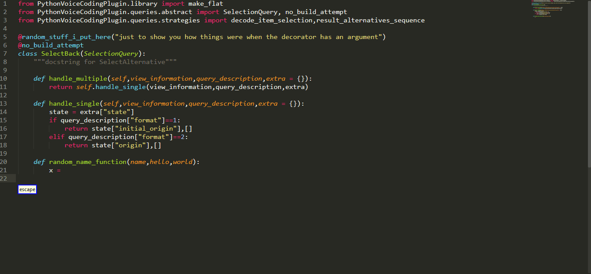
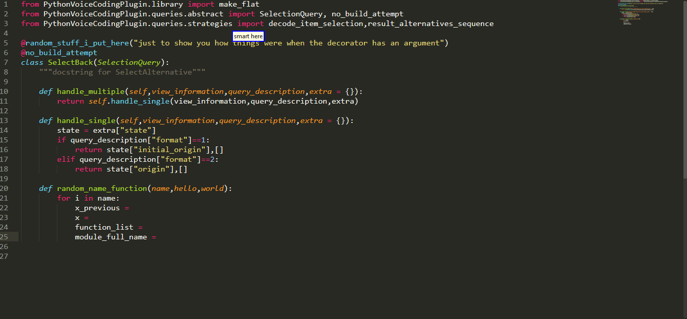
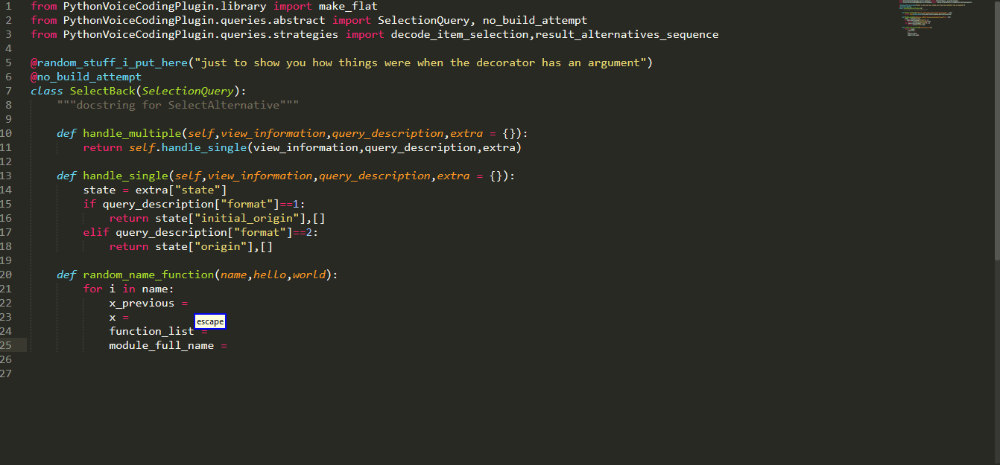
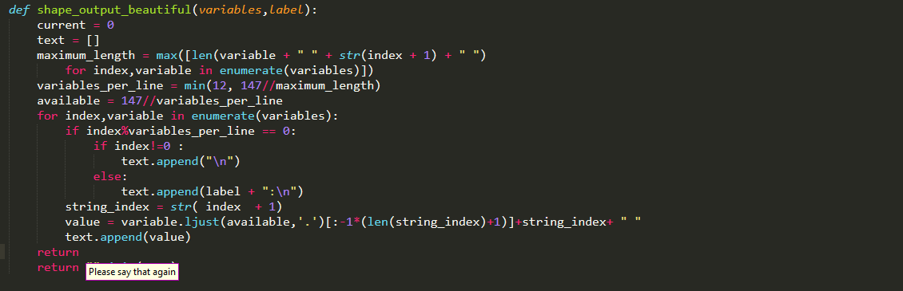
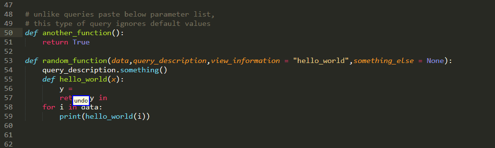

# Collection Queries


## Collecting Interesting Stuff

to collect interesting stuff, the command

```python
"[smart] collect <collectable>"
```

is available. the `collectable` parameter can have one of the following values

```python
 Choice("collectable",{
                "(variable|variables)":"variable",
                "( parameter | parameters)":"parameter",                
                "imported value":"import value",
                "function (name|names)":"function name",
                "class name" : "class name",
                "decorator" : "decorator",
            }
        )
```




## Inserting Items

okay great, so we have collected all the items that you want and they are displayed on the screen. How do you insert them? up to 0.0.4 this syntax was based around `"(smart insert|insert item) <item_index>"` but with a release of 0.1.0 that `(smart insert|insert item)` has been shortened to `[smart] item`  and enhancements have been made, mostly to accommodate the need of quickly inserting multiple items.  


To that end, the new grammar allows you to

* specify a range of items 

* Individually describe multiple items in a row by their index

the corresponding syntax is

```python
"[smart] item <item_index>"

"[smart] (item|items)  (all| <item_index> until (<item_index2>| the end))"

"[smart] (item|items) <item_index>   <item_index2> [  and  <item_index3>]"
``` 

In those multiple values are pasted with commas in between them on the current selection.
To give you an example:



please do note, two important factors. `[smart] item` :

* Does not parse your source code, so it is going to work even if there are fatal errors which might prevent other commands from running

* because collections currently persist between tabs, you can insert items from other source files!

* Is going to use the latest  collection built, even if the display bar has been hidden.

* works with multiple cursors, inserting the same thing in all of them

To illustrate all of the above:




## Index Collectible

so far we have seen two discrete rules, one collecting items and displaying them on the bottom of the screen and pond responsible for inserting them. but for two special cases, namely variables and parameters kinda combine them :)

the core idea is to have commands based on the form

```python
"variable <item_index>"

"parameter <item_index>"
```

which are going to collect variables/parameters from the current function and insert them directly. Combined in these with the ideas developed above for inserting multiple items at once, we obtain something of the form

#### Variables

```python
"[smart] variable <item_index>  [[and] <item_index2> [and <item_index3>]]"

"[smart] (variables all|variable <item_index> until (<item_index2>| the end))"
```



please do pay attention to the fact that variables are extracted only from the current function this time! 

#### Parameters

something similar applies for parameters as well



however in this case we have a little bit more expressiveness available, as we can also insert barometers from other functions! 


```python
"[smart] [<vertical_direction> [<ndir>] [function]] parameter <item_index>  [<item_index2> [and <item_index3>]]"


"[smart] [<vertical_direction> [<ndir>] [function]] (parameters all| parameter <item_index> until (<item_index2>| the end))"
```

notice that the syntax is very similar after the one used by big regions of interest queries `"<vertical_direction> [<ndir>] <block>"` for selecting things from other functions, but function is optional, food can also be used in the more simple and traditional `"<vertical_direction> [<ndir>]"` this was chosen so most makes things easier to speak into either way we are extracting from function definitions:)


