# Operations


## Introduction

Before we get started going through all of the operations available, it would be to go through some basic terms.

### Colors

as a small notice before we get started, because you are going to see colors a lot , you should be aware of the values it can take are

```python
"colors":{
            "main":0,
            "red":1,
            "blue":2, 
            "green":3,
            "yellow":4,
            "orange":5,
},
```

with colors red until orange corresponding to alternatives and the word main to the main result.

### Introduction To Prefix Operations

the format of the operations we are going to discuss in this page, are queries that are executed after some selection query which has yielded some results  and  some alternatives. By using the color keyword, we are able to specify if we want these queries to operate using the main result or one of the alternatives. 

This of course gives us great flexibility but it does come with cost of having to perform everything in 2 steps. 
A cost which is completely unnecessary in cases where

* We are optimistic/confident what the main result of our selection query is going to be

* We are only interested in operating on the main result

And situations like those actually come up very often in day-to-day coding.

As a workaround to both retain this nice flexibility and enable quick tasks to get done in a single query, alongside with the traditional operation queries version 0.1.0 introduced prefix operations. In particular , selection queries can have a "operation" prefix which can take one of the following values

```python
Choice("operation",{
        "paste": "paste",
        "delete":"delete",
        "swap": "swap",
        "edit": "edit",
    }
),
```

what is going to happen after your single spoken command is that the plug-in will be interpreted as a "double" query

- The selection queries going to get executed firstly 

- And is then followed by a secondary operation query operating on the main result

but an important technicality is that the selection query is going to get executed "silently"


## Select Alternatives 


Arguably one of the queries that will become the bread-and-butter for your daily usage  and  is arguably one of the most essential commands of the project.

```python
"smart <color>"
```

As they enable you to select an alternative describing it with the color with which they are highlighted!

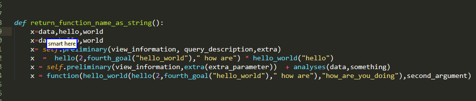


### Multiple Colors

But that these type of queries are not limited to only one color. Instead you can specify more to grab them all under multiple cursors!

```python
"smart <color> [<color2> [<color3> [[and] <color4>]]]"
```

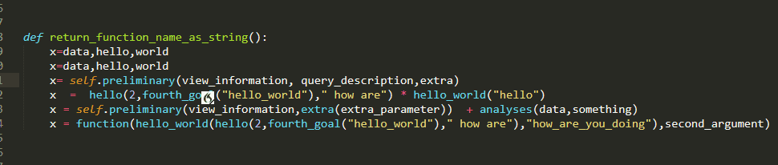


### Multiple Cursors

But things go one step ahead, and this query can also be executed even in cases where you have multiple results each with its own alternatives! 

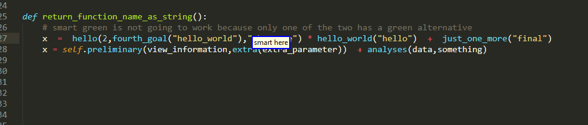

As you can see in the last example the color you specified has to be available for all different cursors! That is a design decision to preserve sanity.

### Legacy Syntax

This is a little bit of legacy code to address the need to be able to work with more than colored five alternatives.

```python
"smart alternative <alternative_index>"
```

As usual `<alternative_index>` is an integer.


### Alternatives Do Not Persist 

this is something important. If you watch carefully for the previous examples you should see that after you use a command to select say `red` alternative , all the other color regions disappear. if you do not want this, you should use the [edit operation instead](#Edit-Operation)


But except selecting alternatives can you also do other things with them? let's find out!

## Delete Operation


For example you can delete an alternative simply by specifying its color and the cursor we will then be placed at its position,ready for editing.

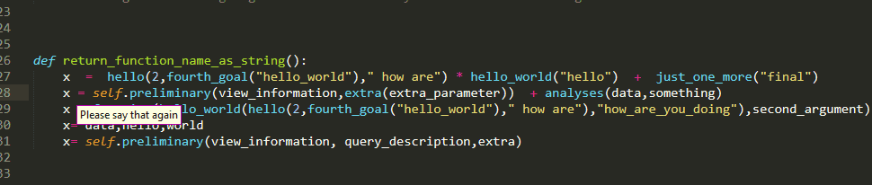

```python
"[smart] delete <color> [<color2> [<color3> [[and] <color4>]]]"
```


Now you could argue that this behavior could be easily replicated by selecting alternatives and then using the standard `clear` and that is probably how you were going to approach this task with 0.0.4. But 

* this is slower, as you need two commands with a pause between them

* Especially, when  used as a prefix as we will see later, delete can easily speed things up and is needed quite often  and  it provides  for  a very natural experience. 

* And you actually cannot not fully replicate it, at least without using the edit operation, because there is one very important difference between the delete and select alternatives commands, which we are going to address right below


### Alternatives Persist

Unlike the previews alternative selection, the delete alternatives query does not make the other alternatives disappear! That is because it is NOT a selection query and even though it does change the current selection , it does so WITHOUT creating a new result/alternatives/origin/initial_origin. The old ones are still there! (okay the one we just deleted is kind of empty:P)

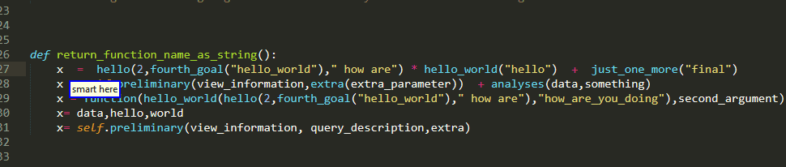

This can be convenient when you want to delete one alternative, write some new code there and then proceed to do the same on another  alternative and so on... though you need to be careful because the current implementation does not track down any code  added  to a deleted alternative, hence no color on the deleted ones


### Multiple Colors

Furthermore, similarly to selecting alternatives, you can simultaneously delete more than one alternatives! you just need to specify more than one colors!

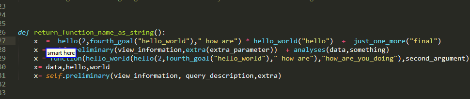


### Multiple Cursors 

And of course multiple cursors are also supported

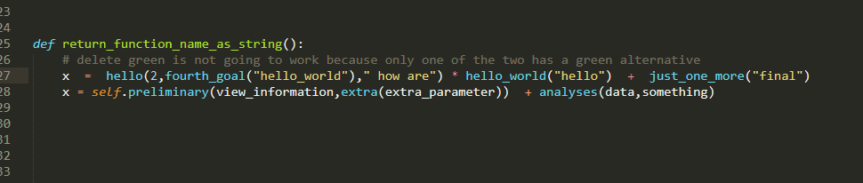


### Delete Prefix Operation 

As mentioned [earlier](#Introduction-To-Prefix-Operations) , you can also use the command  in the form of prefix operations. 

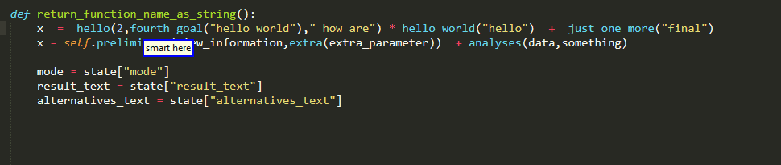

also please note that the  delete operation can handle overlapping results

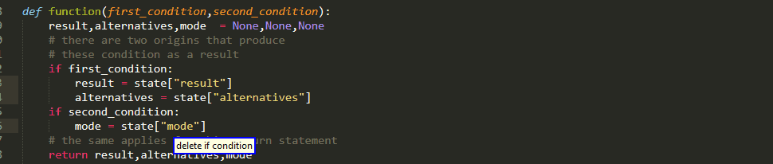


## Pasting Operation

But why would we want to select some text in the first place? Other than editing it in one way or another as we have seen so far, maybe to copy  and paste it somewhere? Very likely where we are currently working or in a place with similar syntactic meaning? Well, the paste back command allows just that! 

It  comes in 2(or 3 depends on your viewpoint) variants

* Pasting To Initial Origin, which is by far the most common based on my usage. itself comes in to sub variants

	- Traditional, which is a typical two-step approach  of waiting for the result and alternative of the selection query and then using a separate pasting command. this option also gives you some formatting options , namely surround what ever is  to be pasted with some punctuation element.

	- The more optimistic and more stripped down approach of included the prefix in this selection query.

* Pasting Between Alternatives,these rules encourage you with the latest 0.1.0 version of the plug-in and it can come in handy sometimes though I do have to tell you that  personally I do use it less than the other case.


### Pasting To Initial Origin

This is actually one of the first operations provided. The core idea is:

* you are editing some piece of code

* You want to insert another piece of code,  which is already present somewhere else

* You provide the necessary description to select it

* You paste it  back to your initial location.


The syntax to allow that is

```python
"[smart] paste [<color>] back"
```

enabling you to 

* paste an alternative specified by the color keyword

* or omitt it and let it operate on the main result

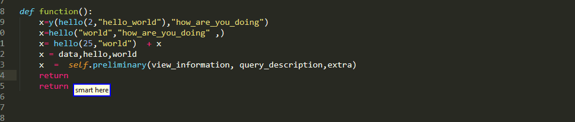

As a side note for those who might want to edit the grammar, please do note that , while optional , color does not have a default value!

#### Surrounding Punctuation

Now you might notice that in the grammar the full command is

```python
"[smart] paste [<color>] back [with <surrounding_punctuation>]"
```

by means of the last optional parameter you can specify some punctuation to surround  what ever is being pasted back. Currently the available options that are provided by default are

```python
Choice("surrounding_punctuation",{
	"quotes":    "quotes",
	"thin quotes": ("'","'"),
	"tickris":   ("`","`"),
	"prekris":     ("(",")"),
	"brax":        ("[","]"),
	"curly":       ("{","}"),
	"angle":     ("<",">"),
	"dot":(".","."),
	"underscore": ("_","_"),
	"(comma|,)": (",",","),
	"ace":(" "," "),
}
``` 

And I say by default because with exception of `""` which unfortunately I have not yet been able support without special handling, there is nothing specific or special about any of the other ones. These were certain simply standard ones and I kept notation consistent with Caster. So feel free to customize to your needs, even with more complex surroundings,like why not `("if "," else ")`?


#### Note For 0.0.4 Users

the old syntax which involved

```python
"paste back [<paste_back_index>]"
```

Has been removed.

### Pasting Between Alternatives

but you are not limited to basting only the initial origin. By means of

```python
"[smart] paste <color> on <color2> [<color3> [ [and] <color4>]]"
```

you are able to paste one of the colored alternatives/result on one or multiple other alternative/result!

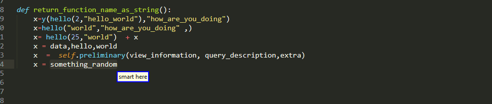

### Pasting Prefix Operation


### Multiple Cursors

#### Multiple Origins Single Result

#### Multiple Origins Multiple Results

#### Single Origin Multiple Results


## Swap Operation

another important operation that is addedwith 0.1.0 is Swap. Now this one is a little bit trickier than on the other ones you kinda need two selections to swap them. Like the pasting Operation it comes into  2(3) formats 

* swapping a result/alternative with the origin , this is what the prefix version also does

* swapping alternatives with each other and the main result 

Let us start with the second case

### Swap Colors 

for the most part pretty straightforward I think 

```python
"[smart] swap <color> with <color2>"
```

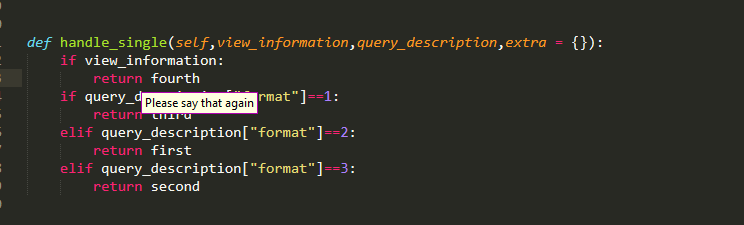

Do keep in mind that alternatives do persist, though they of course get updated 

### Swap Prefix 

And of course this functionality is also available via the `swap` prefix! your current selection is of course going to be the origin of the "silent" selection query and it will be swapped we have that the destination described by it.  

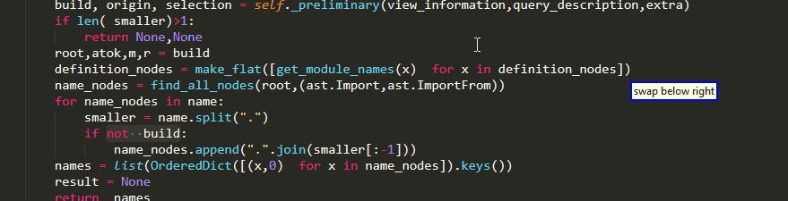


#### Final Cursor Position 

Something to note, is that the cursor will be placed at the destination, which is where your original selection will be!

#### A Tiny Bit Of Extra Functionality

However, unlike the other commands we have seen so far,  when used in prefix mode the swap operation does not fully mimic its traditional variant. 

In particular, if the main result of a selection query is a subset of its origin then attempting to run

```python
"swap main back"
```

is going to fail. On the contrary in the prefix version, if the main result fails, the plug-in is going to try with the highest ranking alternative that does not overlap with origin. This is something I decided to implement because it can make life easier in situations like:


### No Multiple Cursors 

Currently no variant of the swap operation supports multiple cursors.


## Edit Operation

## Utilities 

### Setting Initial Origin

### Return To Origin

