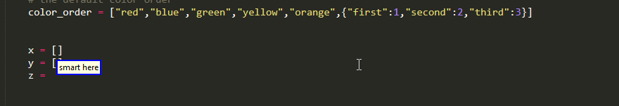
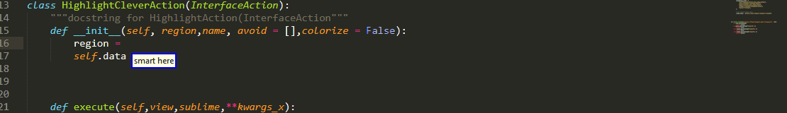
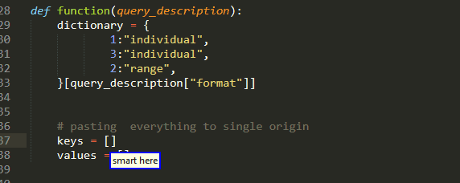
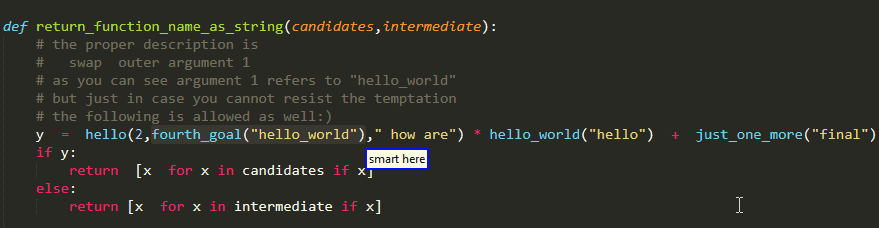

# Operations

<!-- MarkdownTOC autolink="true" -->

- [Introduction](#introduction)
	- [Colors](#colors)
	- [Not Parsing Source Code](#not-parsing-source-code)
	- [Origin And Initial Origin](#origin-and-initial-origin)
		- [Motivation](#motivation)
		- [Clarifying Successive](#clarifying-successive)
	- [Introduction To Prefix Operations](#introduction-to-prefix-operations)
- [Select Alternatives](#select-alternatives)
	- [Multiple Colors](#multiple-colors)
	- [Multiple Cursors](#multiple-cursors)
	- [Legacy Syntax](#legacy-syntax)
	- [Alternatives Do Not Persist](#alternatives-do-not-persist)
- [Delete Operation](#delete-operation)
	- [Alternatives Persist](#alternatives-persist)
	- [Multiple Colors](#multiple-colors-1)
	- [Multiple Cursors](#multiple-cursors-1)
	- [Delete Prefix Operation](#delete-prefix-operation)
- [Pasting Operation](#pasting-operation)
	- [Pasting To Initial Origin](#pasting-to-initial-origin)
		- [Surrounding Punctuation](#surrounding-punctuation)
			- [Experimental Formatting Options](#experimental-formatting-options)
		- [Note For 0.0.4 Users](#note-for-004-users)
	- [Pasting Between Alternatives](#pasting-between-alternatives)
	- [Paste Back Prefix Operation](#paste-back-prefix-operation)
	- [Multiple Cursors](#multiple-cursors-2)
		- [Multiple Origins Multiple Results](#multiple-origins-multiple-results)
			- [Vanilla Example](#vanilla-example)
			- [Overlapping Results](#overlapping-results)
			- [Intermediate Single](#intermediate-single)
		- [Multiple Origins Single Result](#multiple-origins-single-result)
		- [Single Origin Multiple Results](#single-origin-multiple-results)
			- [Surrounding Punctuation Around Every Element](#surrounding-punctuation-around-every-element)
- [Swap Operation](#swap-operation)
	- [Swap Colors](#swap-colors)
	- [Traditional Swap Operation](#traditional-swap-operation)
	- [Swap Prefix](#swap-prefix)
		- [Final Cursor Position](#final-cursor-position)
		- [A Tiny Bit Of Extra Functionality](#a-tiny-bit-of-extra-functionality)
	- [No Multiple Cursors](#no-multiple-cursors)
- [Edit Color Operation](#edit-color-operation)
	- [Trivia](#trivia)
- [Utilities](#utilities)
	- [Return To Origin](#return-to-origin)
	- [Setting Initial Origin](#setting-initial-origin)

<!-- /MarkdownTOC -->


## Introduction

Before we get started going through all of the operations available, it would be good to go through/refresh memory regarding some basic terms.

### Colors 

As you should probably already be familiar with, Selection Queries produce alternatives which get color highlighted in the code. This is important because the commands that follow in this page can 

* Use one of those alternatives instead of operating on/with the main result, for instance pasting the red alternative to one location instead of the main result

or they might even

* Apply some action between those alternatives, for example swapping the red alternative with the blue one

So because you are going to see colors a lot , you should be aware of the values it can take 

```python
"colors":{
            "main":0,
            "red":1,
            "blue":2, 
            "green":3,
            "yellow":4,
            "orange":5,
},
```

with colors red until orange corresponding to alternatives and the word main to the main result.

### Not Parsing Source Code

As a second note, all the commands  that we are going to investigate in this page do not require parsing the source code. This means that they ran faster and can also work even when there are fatal parsing errors.  

###  Origin And Initial Origin

Long story short, we have seen that  a Selection Query is producing

- a main  result and

- alternatives

Information about those is stored in the application state that plug-in maintains  for each open file. But the state also maintains information about two other important variables

* `origin` which is where it came from, a.k.a. the cursor location  at the time it was invoked 

* `initial_origin` which essentially is the very first origin when there are multiple successive such queries

But why do we need them, why both and what precisely do we mean by successive? 

#### Motivation

Originally the need  came from the [paste back command](#pasting-operation) 

In particular,we have seen that there is a variety of ways with which we can select some region of interest. 
But why would we want to select that text in the first place? Very often that is because we want to

* edit it or maybe

* to copy  and paste it somewhere

and should it be the latter case, is it not very likely that we want to insert it where we are currently working? 

So we can see that there must be some concept of remembering where a query originated from. But selecting the location might sometimes be very hard to do in one go and so you might have to break the description into multiple queries. For example, you might use

```python
"up 2 functions second right"
```

followed by

```python
"second argument 2"
```

or there might be situations where you have made a mistake and selected something that is one line below what you want, so you need an additional command because of that mistake. 

as you can see, that is quite and lot of value in maintaining information about where some query originated in the first place. 

#### Clarifying Successive

By successive selection queries,


### Introduction To Prefix Operations

the format of the operations we are going to discuss in this page, are queries that are executed after some selection query which has yielded some results  and  some alternatives. By using the color keyword, we are able to specify if we want these queries to operate using the main result or one of the alternatives. 

This of course gives us great flexibility but it does come with cost of having to perform everything in 2 steps. 
A cost which is completely unnecessary in cases where

* We are optimistic/confident what the main result of our selection query is going to be

* We are only interested in operating on the main result

And situations like those actually come up very often in day-to-day coding.

As a workaround to both retain this nice flexibility and enable quick tasks to get done in a single query, alongside with the traditional operation queries version 0.1.0 introduced prefix operations. In particular , selection queries can have a "operation" prefix which can take one of the following values

```python
Choice("operation",{
        "paste": "paste",
        "delete":"delete",
        "swap": "swap",
        "edit": "edit",
    }
),
```

what is going to happen after your single spoken command is that the plug-in will be interpreted as a "double" query

- The selection queries going to get executed firstly 

- And is then followed by a secondary operation query operating on the main result

but an important technicality is that the selection query is going to get executed "silently"


## Select Alternatives 


Arguably one of the queries that will become the bread-and-butter for your daily usage  and  is arguably one of the most essential commands of the project.

```python
"smart <color>"
```

As they enable you to select an alternative describing it with the color with which they are highlighted!


### Multiple Colors

But that these type of queries are not limited to only one color. Instead you can specify more to grab them all under multiple cursors!

```python
"smart <color> [<color2> [<color3> [[and] <color4>]]]"
```


### Multiple Cursors

But things go one step ahead, and this query can also be executed even in cases where you have multiple results each with its own alternatives! 


As you can see in the last example the color you specified has to be available for all different cursors! That is a design decision to preserve sanity.

### Legacy Syntax

This is a little bit of legacy code to address the need to be able to work with more than colored five alternatives.

```python
"smart alternative <alternative_index>"
```

As usual `<alternative_index>` is an integer.


### Alternatives Do Not Persist 

this is something important. If you watch carefully for the previous examples you should see that after you use a command to select say `red` alternative , all the other color regions disappear. if you do not want this, you should use the [edit operation instead](#Edit-Operation)


But except selecting alternatives can you also do other things with them? let's find out!

## Delete Operation


For example you can delete an alternative simply by specifying its color and the cursor we will then be placed at its position,ready for editing.


```python
"[smart] delete <color> [<color2> [<color3> [[and] <color4>]]]"
```


Now you could argue that this behavior could be easily replicated by selecting alternatives and then using the standard `clear` and that is probably how you were going to approach this task with 0.0.4. But 

* this is slower, as you need two commands with a pause between them

* Especially, when  used as a prefix as we will see later, delete can easily speed things up and is needed quite often  and  it provides  for  a very natural experience. 

* And you actually cannot not fully replicate it, at least without using the edit operation, because there is one very important difference between the delete and select alternatives commands, which we are going to address right below


### Alternatives Persist

Unlike the previews alternative selection, the delete alternatives query does not make the other alternatives disappear! That is because it is NOT a selection query and even though it does change the current selection , it does so WITHOUT creating a new result/alternatives/origin/initial_origin. The old ones are still there! (okay the one we just deleted is kind of empty:P)


This can be convenient when you want to delete one alternative, write some new code there and then proceed to do the same on another  alternative and so on... though you need to be careful because the current implementation does not track down any code  added  to a deleted alternative, hence no color on the deleted ones


### Multiple Colors

Furthermore, similarly to selecting alternatives, you can simultaneously delete more than one alternatives! you just need to specify more than one colors!


### Multiple Cursors 

And of course multiple cursors are also supported


### Delete Prefix Operation 

As mentioned [earlier](#Introduction-To-Prefix-Operations) , you can also use the command  in the form of prefix operations. 


also please note that the  delete operation can handle overlapping results


## Pasting Operation

But why would we want to select some text in the first place? Other than editing it in one way or another as we have seen so far, maybe to copy  and paste it somewhere? Very likely where we are currently working or in a place with similar syntactic meaning? Well, the paste back command allows just that! 

It  comes in 2(or 3 depends on your viewpoint) variants

* Pasting To Initial Origin, which is by far the most common based on my usage. itself comes in to sub variants

	- Traditional, which is a typical two-step approach  of waiting for the result and alternative of the selection query and then using a separate pasting command. this option also gives you some formatting options , namely surround what ever is  to be pasted with some punctuation element.

	- The more optimistic and more stripped down approach of included the prefix in this selection query.

* Pasting Between Alternatives,these rules encourage you with the latest 0.1.0 version of the plug-in and it can come in handy sometimes though I do have to tell you that  personally I do use it less than the other case.


### Pasting To Initial Origin

This is actually one of the first operations provided. The core idea is:

* you are editing some piece of code

* You want to insert another piece of code,  which is already present somewhere else

* You provide the necessary description to select it

* You paste it  back to your initial location.


The syntax to allow that is

```python
"[smart] paste [<color>] back"
```

enabling you to 

* paste an alternative specified by the color keyword

* or omitt it and let it operate on the main result


As a side note for those who might want to edit the grammar, please do note that , while optional , color does not have a default value!

#### Surrounding Punctuation

Now you might notice that in the grammar the full command is

```python
"[smart] paste [<color>] back [with <surrounding_punctuation>]"
```

by means of the last optional parameter you can specify some punctuation to surround  what ever is being pasted back. Currently the available options that are provided by default are

```python
Choice("surrounding_punctuation",{
	"quotes":    ("quotes","quotes")
	"thin quotes": ("'","'"),
	"tickris":   ("`","`"),
	"prekris":     ("(",")"),
	"brax":        ("[","]"),
	"curly":       ("{","}"),
	"angle":     ("<",">"),
	"dot":(".","."),
	"underscore": ("_","_"),
	"(comma|,)": (",",","),
	"ace":(" "," "),
}
``` 

And I say by default because with exception of `""` which unfortunately I have not yet been able support without special handling due to escaping issues, there is nothing specific or special about any of the other ones. These were certain simply standard ones and I kept notation consistent with Caster. So feel free to customize to your needs, even with more complex surroundings.




##### Experimental Formatting Options

currently this is only experimental and most likely subject to change, but as an extension to the above surrounding options, the backend for 0.1.0 also supports that you provide a single string instead of a tuple. In such a case, instead of pasting something like

```python
surrounding[0] + result + surrounding[1]
```

we can denote with  `$$` the text that is to be pasted back, then this string will be pasted but with a corresponding text replacing the `$$` ! To make this clearer with an example 

```python
"truth comprehension":"$$ = [x  for x in $$ if x]",
"force list": "$$ if isinstance($$,list) else [$$] ",
"key value":"quotes$$quotes:$$",
```

you can do things like





Of course this is still pretty primitive, and serious will be needed to make format options truly powerful, but I would love to hear your thoughts, regarding whether you find this useful!

#### Note For 0.0.4 Users

the old syntax which involved

```python
"paste back [<paste_back_index>]"
```

Has been removed.

### Pasting Between Alternatives

but you are not limited to pasting only to the initial origin. By means of

```python
"[smart] paste <color> on <color2> [<color3> [ [and] <color4>]]"
```

you are able to paste one of the colored alternatives/result on one or multiple other alternative/result!


### Paste Back Prefix Operation

And at long last here we are! From my experience, this is probably  the method you are most likely going to enjoy using as 

* it enables you to paste in a single step.

* as a prefix query it is a bit more "silent"

Using it is pretty straightforward

```python
"paste <description of region of interest>"
```

and  the corresponding region will be pasted on the current cursor position!


### Multiple Cursors

It is high time we address the issue of how things work with multiple cursors. Now in general it is my recommendation that if you are in doubt, you should best approach this with your intuition rather than trying to remember all the various cases. Nonetheless we are going to show some examples so that you can get the idea

There are various sources which can introduce some complexity but don't be afraid


To be honest,despite all these complications, I wouldn't say that my handling of this issue is ideal  and  some upgrades might probably be required but what is now released should cover most common cases.


For the examples to follow, I may use the traditional and the prefix version interchangeably.

#### Multiple Origins Multiple Results

In general if you have multiple origins and multiple results their numbers need to be equal, that means every gets pasted on  precisely one initial origin! 


##### Vanilla Example

Let's begin with the most simple example. We have multiple origins , a selection query produces a single result for each one of them and each result gets pasted back to its corresponding origin.


All origins and results match on the one on one, so no problem.

##### Overlapping Results 

But what if in the above case there were overlapping results? In such a case for up to one level deep there is no problem

 

This overlapping result is actually stored as 2! 

##### Intermediate Single

In case, at some point in the successive selection queries that form a chain you end up with a single result, fear not!
if it branches out once again to multiple results, provided these results match the number of initial origins, they are going to get pasted back and the one on one matching will start from the leftmost the rightmost.

 

#### Multiple Origins Single Result


In situations like these, the previously mentioned rule of thumb

```
In general if you have multiple origins and multiple results their numbers need to be equal, that means every gets pasted on  precisely one initial origin!
```

of course cannot apply. Probably the most intuitive thing to do that in such cases is to paste this single result everywhere and this is the approach that has been taken


#### Single Origin Multiple Results

Finally, suppose now that you have started from just a single origin and value of many results. These can happen for instance if 

* you grab alternatives under multiple cursors with select alternatives

* You use a command which branches out multiple results per input selection  like `every part [<sub_index>]`

* at some point you manually grabbed multiple cursors with external sublime key shortcuts and so on

The current approach to this issue is to paste all of them back to the initial origin separated by `,` delimiter




##### Surrounding Punctuation Around Every Element

Also note that regarding `<surrounding_punctuation>` the approach taken


these as you can see to surround every element with a punctuation and still have a `,` delimiter between them.

## Swap Operation

another important operation that is addedwith 0.1.0 is Swap. Now this one is a little bit trickier than on the other ones as you kinda need two selections to swap them. Like the pasting Operation it comes into  2(3) formats 

* swapping a result/alternative with the origin , this is what the prefix version also does

* swapping alternatives with each other and the main result 

Let us start with the second case

### Swap Colors 

for the most part pretty straightforward I think 

```python
"[smart] swap <color> with <color2>"
```


Do keep in mind that alternatives do persist, though they of course get updated 


### Traditional Swap Operation

The traditional swap operation has the following syntax

```python
"[smart] swap [<color>] back"
```

and swaps the main result/alternative of the last selection query with  its ORIGIN. Please not the initial origin, like a paste back operation does! 

As an example 


### Swap Prefix 

And of course this functionality is also available via the `swap` prefix! your current selection is of course going to be the origin of the "silent" selection query and it will be swapped we have that the destination described by it.  


#### Final Cursor Position 

Something to note, is that the cursor will be placed at the destination, which is where your original selection will be!

#### A Tiny Bit Of Extra Functionality

However, unlike the other commands we have seen so far,  when used in prefix mode the swap operation does not fully mimic its traditional variant. 

In particular, if the main result of a selection query is a subset of its origin then attempting to run

```python
"swap main back"
```

is going to fail. 

On the contrary in the prefix version, if the main result fails, the plug-in is going to try with the highest ranking alternative that does not overlap with origin. This is something I decided to implement because it can make life easier in situations like:



### No Multiple Cursors 

Currently no variant of the swap operation supports multiple cursors.


## Edit Color Operation

```python
"edit <color> [<color2> [<color3> [[and] <color4>]]]"
```

This command works like select alternative but it does not affect neither the origin/initial_origin nor the result/alternatives. It simply changes the cursor selection!


### Trivia

Now this a little bit different from what we have seen so far, in in that edit command is actually a pseudo-command. If you actually take a look at the grammar, what are you going to see is 

```python
"edit <color> [<color2> [<color3> [[and] <color4>]]]":
	lazy_value("alternative",3,operation = "edit"),
```

it is actually implemented via SelectAlternative followed by an edit prefix operation:P 

## Utilities 

Except for the more standard operations we have seen so far, release 0.1.0 comes with a handful of hopefully useful utilities, which I plan to respond in the future. For the time being the available ones are:

```python
       "[smart] back initial":
            lazy_value("select_back",1),
        "smart back":
            lazy_value("select_back",2),
        "smart here":
            lazy_value("remember_here",1),

```

So let us take a look at them!

### Return To Origin

So far we have seen that we can paste things back to the initial origin, But what if you want to simply go back to it?
Release 0.1.0 has made possible via

```python
"[smart] back initial"
```


and if you want the origin, then simply

```python
"smart back"
```


Please pay attention because this is actually a selection query and does a consequence it also does set the origin!
So in the last example,even though we are going back to the initial origin, our selection before doing so is accessible via `smart back`!

Something also of importance is that this functionality  can couple nicely with the whole state persistence that characterizes prefix operations.


### Setting Initial Origin

When we discussed the concept over the initial origin, we saw thought in order for it to change we must first cause some change to our code. While this enables us to utilize powerful successive / chains of selection queries,it is problematic for instance in cases where we want the current selection to become initial origin. To address this issue the dedicated 

```python
"smart here"
```

Was introduced 


