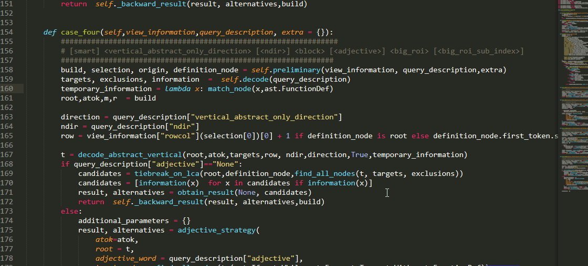
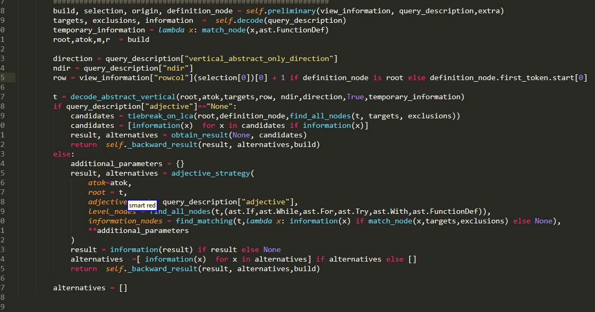
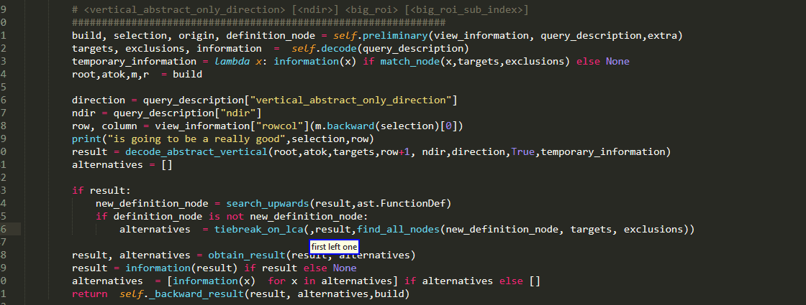
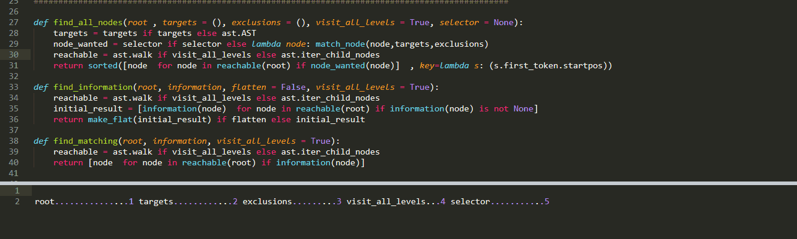

# User Guide 

<!-- MarkdownTOC  autolink="true" -->

- [Documentation Index](#documentation-index)
- [General Remarks](#general-remarks)
	- [Caster Version Supported](#caster-version-supported)
	- [Versioning And Backwards Compatibility](#versioning-and-backwards-compatibility)
		- [TLDR](#tldr)
		- [Long Version](#long-version)
	- [Experiment Or Unofficial And So On Features You Need To Enable Manually](#experiment-or-unofficial-and-so-on-features-you-need-to-enable-manually)
	- [Grammar Plug-In Interface](#grammar-plug-in-interface)
		- [Core Idea](#core-idea)
		- [Technicalities](#technicalities)
		- [I am lazy](#i-am-lazy)
	- [Linux  and Aenea](#linux-and-aenea)
	- [Grammar Local Settings](#grammar-local-settings)
		- [Show Command](#show-command)
		- [Force RPC](#force-rpc)
- [Quick Command Overview](#quick-command-overview)
	- [Selection Queries](#selection-queries)

<!-- /MarkdownTOC -->


## Documentation Index

* `WARNING` the following links contain pages heavy in gifs making their size relatively big. If you are on mobile, it might be best to view them via wifi instead of mobile data.

Some quick links to the various documentation files

* [Argument Queries](./SelectArgument.md)

* [Big Roi Queries](./SelectBigROI.md)

* [Sub Indexing](./SubIndexing.md)

* [Collection Queries](./CollectionQueries.md)

* [Operations](./Operations.md)

* [grammar sublime interface](./GrammarSublimeInterface.md)


## General Remarks 

### Caster Version Supported

Currently   Caster 0.5, 0.6, 1.0 are all supported but it is my recommendation that you update to the latest master or anything >=1.0, as 1.0.0 introduced various improvements and sooner or later support for the two older versions of Caster or will be dropped.

### Versioning And Backwards Compatibility


#### TLDR

If at some point you upgraded the main plugin to version 0.1.x, you do not need to manually upgrade your grammar file as well, you can still use the old 0.1.0 grammar.

#### Long Version

As this project is a two-part system, consisting of both

* grammar files and 

* the main plug-in

a question that arises is whether you can use a grammar file with the plug-in ,when their versions are different.
This is very important because as a consequence of this architecture ,upgrades may require changes to 

- Only the grammar file, for instance when changing only the spoken form of a command

- Only the main plug-in, for instance when fixing a bug that appears in an edge case

- Both the grammar and the main plug-in, for instance when adding completely new commands


so these could be a source of confusion. In order to avoid these confusion as well as the burden of constantly manually copy pasting the grammar files

* Changes to the  existing grammar will only be made on minor releases!

* Patches are only going to affect the backend

As a consequence you can use the grammar released with  0.1.0 with any of the 0.1.x versions of the plug-in. there will be none the less two exceptions to that rule

- If there's a small critical bug that I have missed the grammar, in which case you will be notified accordingly

- Experimental features, which are either way not stable and not enabled by default!

We're going to see more about them.

### Experiment Or Unofficial And So On Features You Need To Enable Manually 

If you open up the grammar file, you should notice that there are various lines that are commented. These are features that do require modifications to the grammar bundles but which I have chosen to leave out from "official" grammar because I consider them likely going to be subject to change. This might be because they 

- are experimental features that may need enhancements and further testing before settling on their final version 

- are a solution that is only meant temporarily until the next minor release introduce a proper one

- enhance existing functionality, but with a grammar complex cost which not all users might want.

Whatever the case, what you should keep in mind is that 

* They are supported by the backend

* I can't really guarantee that they will not receive changes on the grammar side between patches

If you're interested,here are some you can try:


* [Same in big ROI](./SelectBigROI.md#temporary-until-small-regions)

* [Temporary workaround for small regions](./SelectBigROI.md#temporary-until-small-regions)

* [Going deeper with sub indexing](./SubIndexing.md#Semi-Experimental)

* [Formatting parameter insertion](./CollectionQueries.md#experimental)

* [Paste Back Experimental Formatting Options](./Operations.md#Experimental-Formatting-Options)


Feedback Is Much Appreciated!


### Grammar Plug-In Interface 

This section deserves more documentation than currently is being provided so at some point I would see that it gets a page off its own. 


For communication between the  grammar and the main plug-in  the [sublime command line interface](https://www.sublimetext.com/docs/3/osx_command_line.html) is used.


#### Core Idea

Suppose we use a command like

```
"first right 2"
```

As we're going to see later, this corresponds to the second variant of the [big ROI queries](./SelectBigROI.md)

```python
"[(smart|<operation>)] <nth> <big_roi> [<sub_index>]":
	lazy_value("big_roi",2),
```

now what we want is to inform sublime of both the type  and variant of query to be executed, as well as all the necessary parameters


The script is going to invoke the subl commandline tool with a command like that ignoring some technicalities looks like

``` bash
subl --command python_voice_coding_plugin { "arg" : {
  "command":"argument",
  "format":1,
  "nth":"first",
  "big_roi":"assignment right",
  "sub_index":2,
  }
}
```

#### Technicalities

Now in reality what it will send is going to be

```bash
subl --command "python_voice_coding_plugin  {\"arg\": {\"level_index\": 0, \"sub_index\": 2, \"format\": 2, \"nth\": \"first\", \"command\": \"big_roi\", \"big_roi\": \"assignment right\", \"ndir\": 1}}"
```

which is a little bit different because 

* For things to work in the command line we need to escape quotes

* You see 2 seemingly random key value pairs appearing, these correspond to parameters that appear in their specs and have default values

#### I am lazy


### Linux  and Aenea

Oversimplifying, in order for you to execute remote actions with Aenea ,the client sends json rpc to the server,which contains a description of which function to run on the server side and what arguments to pass to the function. 

Because the current Grammar Plug-In Interface uses the sublime command line interface instead of keypresses, we need a custom function on the server-side to invoke it. To that end we need to create a server plug-in defining that function and have the client send custom RPC that will instruct the server to use it on the Linux machine. 

You can find more details [here](../bundles/Aenea/README.md) about how to install this server plug-in, but essentially it comes down to copy pasting BOTH following files

- PythonVoiceCodingPluginAeneaServer.py

- PythonVoiceCodingPluginAeneaServer.yapsy-plugin

which you can retrieve from `bundles/Aenea` folder to the appropriate server plug-in folder of the Linux machine


On the client side, is more or less automatically for you, as when 

```python
settings.SETTINGS["miscellaneous"]["use_aenea"]
```

is true and which you can set in your  Caster settings.toml  file , when the grammar loads it will sent

```python
using_rpc = True
```

and after every utterance instead of invoking

```python
send_sublime("python_voice_coding_plugin", data)
```

The function

```python
aenea.communications.server.python_voice_coding_plugin_aenea_send_sublime(c="python_voice_coding_plugin",data=data)
```

will be executed transmitting the RPC!


### Grammar Local Settings

In the grammar file you might notice there is a section

```python
local_settings = {
    "show_command":False,
    "force_rpc":False,
}
```

which are just a couple of settings for the interested user

#### Show Command 

This setting is for users who are interested in how the command line interface with sublime works. By setting  to true, you should see in the NatLink window, the command that is actually sent to sublime. For instance, author speaking the utterance `below function first right 1`, which falls under the 

```python
        "[smart] <vertical_direction> [<ndir>] <block> [<nth>] <big_roi> [<sub_index>]":
            lazy_value("big_roi",4),
```

you should see in the NatLink window

```python
subl --command "python_voice_coding_plugin  {\"arg\": {\"level_index\": 0, \"sub_index\": 1, \"format\": 4, \"vertical_direction\": \"downwards\", \"nth\": \"first\", \"command\": \"big_roi\", \"big_roi\": \"assignment right\", \"block\": \"function\", \"ndir\": 1}}"
```


#### Force RPC

This is a little bit of a small trick which I'm not sure if or  how many people will find useful and  you should probably avoid it, but I have found sometimes myself using it, so who knows? 

Currently my setup  for Aenea is a little bit reverse from what is used to. My host these in windows 10 machine and my guest is an Ubuntu 16.04 inside the virtual box. As a consequence pure dragonfly keystrokes can work both on the Windows Host as well as the Linux guest, whereas Aenea ones only work on the guest. Furthermore,


## Quick Command Overview

Here we will briefly go over the commands offered. 

Before we get started, a small general remark: 
```
tip: if you do not know what to say, say smart :P
```

because virtually every command starts with the keyword smart! 

```python
"smart <big_roi> [<big_roi_sub_index>]"

"smart <color> [alternative]"
```

This was chosen in order to minimize chances of collision with other commands on your system. However, because for a variety of commands, omitting the keyword smart makes them more convenient and easier to speak
you may find the smart keyword in brackets

```python
"[smart] alternative <alternative_index>"

"[smart] paste back [<paste_back_index>]"

"[smart] paste <color> back"
```

if there are conflicts with other commands, try to remove those brackets (making smart not optional). Furthermore, I think it is best not to put brackets in cases where I haven't.  

After the small remark let's get started!


### Selection Queries

At the heart of the whole project lie selection queries, as they provide you with the most fundamental functionality, namely selecting text. To that end , the spoken form for these queries essentially consists of a description for the region you are interested in and the backend processes these descriptions in order to decide what it should select. However apart from the

* main result,which  is what it thinks is the best match for your description, the plug-in is also going to produce

* alternatives,which are other possible matches and  the top five ranking of which are going to get color highlighted in the code. 

The available colors are:

```python
"red","blue","green","yellow","orange"
```

and they will be assigned to alternatives in that order. As a note, if there are overlaps, the colors might be more intense or changed a bit. As we are going to see later you can easily select one (or even more of them) instead of the main result simply by describing them with their color.

As of 0.1.0 there are three main such queries:

* for selection of arguments or other parts of function calls there is the [Select Argument](SelectArgument.md) command


* for selecting big Gary region of interest such as the right hand side of an assignment or an if condition there is [Select Big ROI](SelectBigROI.md) command 



* Finally, for selecting smaller piece out of a bigger region there are the dedicated [SubIndexing](./SubIndexing.md) commands 


For more specifics you can view the corresponding documentation but I would like to note a couple of things about the first two methods they more or less share. Essentially, despite their differences both commands they both follow the pattern

```python
[optional additional positional information] [name of what you want]
```

In general, the second part informs the plug-in of what kind of region you are looking for  and  the first part provides additional positional information about which specific of the many candidates matching  that description. If no positional information is provided, then the nearest one, as seen from the view of the AST , will be selected. ( essentially lowest common ancestor with some additional heuristics for tie-breaking)
 

Though the format over the additional positional information  varies greatly between commands and you should go through the corresponding documentation, for the sake of making that process easier I would like to stress out that some building blocks are common. For example 


* if you wish to specify the order of your region of interest, then you probably need an `nth adjective` :

```python
```python
"first"             "second"
"third"             "fourth"
"fifth"             "sixth"
"seventh"           "eighth"
"ninth"             "last"
"second last"       "third last"
"fourth last"
```


and 

* if you want to  specify the relative vertical position with respect to your current selection, probably you need one of these `<vertical_direction>` keywords: 


```python
"(up|sauce|above)":"upwards",

"(down|dunce|below)":"downwards",
```

followed by an integer. Beware though there are difference between the way these are used by the plug-in because they only take "interesting" lines into consideration.


I do not expect these examples to make this distinction clear, just keep this in mind and will discuss it more later.


* in certain cases you can combine these two approaches


Details vary but that is the. spirit! Ok , what else?


### Alternatives

As you can see, these commands select some ROI (region of interest) and generate alternatives. These alternatives are shown to the user in an output panel on the bottom of the screen and the top ones get highlighted in the code as well. 

We can select one of those alternatives with the alternative rule which comes in two variations:

```python
"[smart] alternative <alternative_index>"

"smart <color> [alternative]"
```


alternative_index is an integer
```python
(Tip : index --> integer)
``` 
whereas color is an adjective corresponding the color highlighting:

```python
Choice("color",{
		"red":1, "blue":2, "green":3, "yellow":4, "orange":5, 
	} 
)
```

### Paste Back 

But why would we want to select some text in the first place? Other than editing it, maybe to copy it and paste it somewhere? Very likely where we are currently working? Well, the paste back command allows just that! 



As you can see it comes in two formats: 
```python
"[smart] paste back [<paste_back_index>]"

"[smart] paste <color> back"
```

If no alternative is specified the main result is pasted back!

Please also pay attention to the following:


That is you can use successive selection queries and paste back will insert in your original starting position!


So we can select some basic stuff and we can insert it where we are writing. What elae can we do?

### Collection Queries 

Imagine a case where you have a variable or parameter name or an expression with perhaps many atoms that are hard to dictate. 

If you dont want to rely on autocompletion you can for instance select it and paste it back:) But what if you need to write it several times in dofferent locations? Or what if it is so far away in the code you cannot really describe it?(say an imported item whose full name you dont even remember)


Collection Queries try to address this issue. These collect the text of interesting regions and display it on the bottom panel.


you can collect a variety of things:

```python
Choice("collectable",{
	"(variable|variables)":"variable",
	"( parameter | parameters)":"parameter",
	"(module|modules)":"module",
	"imported (value|object)":"import value",
	"function ( name |names)":"function name",
} 
```
please note that these items are collected from the whole source code.

### Insert Item

These "items" can then be inserted in the current cursor position by means of the 

```python
"(smart insert|insert item) <item_index>"
```
command. Item_index specifies which item from the collection you want


### index collectible

certain collectible items such as variables and parameters can be index collected by means of a query like

```python
"[smart] variable <collect_index>"
```
In such a case, items will only be collected from the current function  and in item will be inserted
based on the index specified and their order of appearance




