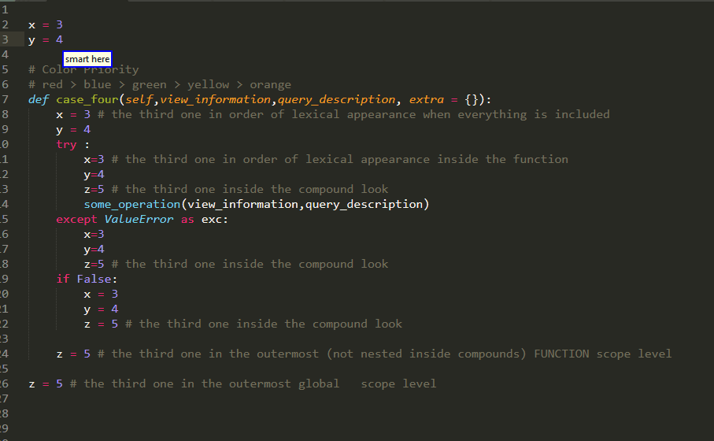
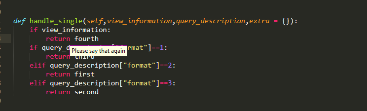

# User Guide 

<!-- MarkdownTOC  autolink="true" -->

- [Documentation Index](#documentation-index)
- [General Remarks](#general-remarks)
	- [Caster Version Supported](#caster-version-supported)
	- [Versioning And Backwards Compatibility](#versioning-and-backwards-compatibility)
		- [Short Version](#short-version)
		- [Long Version](#long-version)
	- [Experiment Or Unofficial And So On Features You Need To Enable Manually](#experiment-or-unofficial-and-so-on-features-you-need-to-enable-manually)
	- [Grammar Plug-In Interface](#grammar-plug-in-interface)
		- [Core Idea](#core-idea)
		- [Technicalities](#technicalities)
		- [I am lazy And I Know It](#i-am-lazy-and-i-know-it)
	- [Linux  and Aenea](#linux-and-aenea)
	- [Sublime Settings](#sublime-settings)
	- [Grammar Local Settings](#grammar-local-settings)
		- [Show Command](#show-command)
		- [Force RPC](#force-rpc)
- [Quick Functionality Overview](#quick-functionality-overview)
	- [A Small Remark](#a-small-remark)
	- [Selection Queries](#selection-queries)
	- [Operations](#operations)
	- [Collection Queries](#collection-queries)

<!-- /MarkdownTOC -->


## Documentation Index

* `WARNING` the following links contain pages heavy in gifs making their size relatively big. If you are on mobile, it might be best to view them via wifi instead of mobile data.

Some quick links to the various documentation files

* [Argument Queries](./SelectArgument.md)

* [Big Roi Queries](./SelectBigROI.md)

* [Sub Indexing](./SubIndexing.md)

* [Collection Queries](./CollectionQueries.md)

* [Operations](./Operations.md)


## General Remarks 


### Caster Version Supported

Currently   Caster 0.5, 0.6, 1.0 are all supported but it is my recommendation that you update to the latest master or anything >=1.0, as 1.0.0 introduced various improvements and sooner or later support for the two older versions of Caster or will be dropped.

### Versioning And Backwards Compatibility


#### Short Version

If at some point you upgraded the main plugin to version 0.1.x, you do not need to manually upgrade your grammar file as well, you can still use the old 0.1.0 grammar.

#### Long Version

As this project is a two-part system, consisting of both

* grammar files and 

* the main plug-in

a question that arises is whether you can use a grammar file with the plug-in ,when their versions are different.
This is very important because as a consequence of this architecture ,upgrades may require changes to 

- Only the grammar file, for instance when changing only the spoken form of a command

- Only the main plug-in, for instance when fixing a bug that appears in an edge case

- Both the grammar and the main plug-in, for instance when adding completely new commands


so these could be a source of confusion. In order to avoid these confusion as well as the burden of constantly manually copy pasting the grammar files

* Changes to the  existing grammar will only be made on minor releases!

* Patches are only going to affect the backend

As a consequence you can use the grammar released with  0.1.0 with any of the 0.1.x versions of the plug-in. there will be none the less two exceptions to that rule

- If there's some critical bug that I have missed the grammar or a minor code  tweak that does not affect the rules themselves, in which case you will be notified accordingly

- Experimental features, which are either way not stable and not enabled by default!

We're going to see more about them.

### Experiment Or Unofficial And So On Features You Need To Enable Manually 

If you open up the grammar file, you should notice that there are various lines that are commented. These are features that do require modifications to the grammar bundles but which I have chosen to leave out from "official" grammar because I consider them likely going to be subject to change. This might be because they 

- are experimental features that may need enhancements and further testing before settling on their final version 

- are a solution that is only meant temporarily until the next minor release introduce a proper one

- enhance existing functionality, but with a grammar complex cost which not all users might want.

Whatever the case, what you should keep in mind is that 

* They are supported by the backend

* I can't really guarantee that they will not receive changes on the grammar side between patches

If you're interested,here are some you can try:


* [Same in big ROI](./SelectBigROI.md#temporary-until-small-regions)

* [Temporary workaround for small regions](./SelectBigROI.md#temporary-until-small-regions)

* [Going deeper with sub indexing](./SubIndexing.md#Semi-Experimental)

* [Formatting parameter insertion](./CollectionQueries.md#experimental)

* [Paste Back Experimental Formatting Options](./Operations.md#Experimental-Formatting-Options)


Feedback Is Much Appreciated!


### Grammar Plug-In Interface 

This section deserves more documentation than currently is being provided so at some point I would see that it gets a page off its own. 


For communication between the  grammar and the main plug-in  the [sublime command line interface](https://www.sublimetext.com/docs/3/osx_command_line.html) is used.


#### Core Idea

In the main plug-in file, I define the following class

```python
class PythonVoiceCodingPluginCommand(sublime_plugin.TextCommand):
```
out of which sublime is going to make a command with a name

```python
"python_voice_coding_plugin"
```

When this command is invoked one way or another, it will run the following  method

```python
def run(self, edit,arg):
```

where `edit`  is something supplied from sublime  and  `arg` is an argument I defined  and  is going to be a dictionary containing all the information we need to describe the query. 

so the plan is to invoke the command line with the following command

```bash
subl --command python_voice_coding_plugin { "arg" : {
		our parameters 
  }
}
```


Suppose we use a command like

```
"first right 2"
```

As we're going to see later, this corresponds to the second variant of the [big ROI queries](./SelectBigROI.md)

```python
"[(smart|<operation>)] <nth> <big_roi> [<sub_index>]":
	lazy_value("big_roi",2),
```

now what we want is to inform sublime of both the type  and variant of query to be executed, as well as all the necessary parameters

* `nth` is a `Choice` which contains the mapping `"first" : "first"` so we're sending `"first"`

* `big_roi` is a `Choice` which contains the mapping `"(assignment right| right)" : "assignment right"` so we are sending `"assignment right"`

* `sub_index` is an optional `IntegerRefST("sub_index",1,10)`  so we are sending simply the number `2`

* `operation` is a `Choice` which can take the following values

```python
Choice("operation",{
                "paste": "paste",
                "delete":"delete",
                "swap": "swap",
                "edit": "edit",
            }
        )
```

Since none of them were  spoken and it has no default value, we don't send anything for it.


The script is going to invoke the subl commandline tool with a command like that ignoring some technicalities looks like

``` bash
subl --command python_voice_coding_plugin { "arg" : {
  "command":"argument",
  "format":1,
  "nth":"first",
  "big_roi":"assignment right",
  "sub_index":2,
  }
}
```

#### Technicalities

Now in reality what it will send is going to be

```bash
subl --command "python_voice_coding_plugin  {\"arg\": {\"level_index\": 0, \"sub_index\": 2, \"format\": 2, \"nth\": \"first\", \"command\": \"big_roi\", \"big_roi\": \"assignment right\", \"ndir\": 1}}"
```

which is a little bit different because 

* For things to [work](https://readthedocs.org/projects/sublime-text-unofficial-documentation/downloads/pdf/latest/#page=63) in the command line, we need to pass both the command name and the dictionary containing our parameters as a single argument. In order to do that we need to encompass them both inside `"`  and  escape  all other quotes,something which is also giving me a  bit of trouble with [this](./Operations.md#Experimental-Formatting-Options) 

* You see 2 seemingly random key value pairs appearing, these correspond to parameters that appear in other specs of the grammar and have default values.


but the latter of the two I do not really consider that much of a problem. What I did have a problem with was forcing sublime to stay on focus after executing the command. to solve this issue I am currently sending second essentially empty `subl` command, which does not satisfy me that much and is not hundred percent bulletproof.

furthermore I'm not sure  if this line

```python
subprocess.call(y, shell = True)
```

is the best but it currently works


#### I am lazy And I Know It

okay so we have seen how we can send dictionary full of meaningful information the main plug-in but how do we created in the first place? Manually specifying for every rule which barometers need to be sent is a terrible waste of time and also inflexible.

Instead what you are going to see a lot

```python
lazy_value("select_part",4)
```

Where the first argument is the name of command we wish to execute, and the second corresponds to format/variant of that rule.


But this is just a wrapper around

```python
def lazy_value(c,f,**kwargs):
    return  R(Function(noob_send, command = c, format = f,**kwargs))
```


Dragonfly makes available to the registered action 

* All the parameters of the spec which were spoken 

* All the default values of the grammar

* Some Other Stuff, which we filter out


as a consequence, if we include `**kwargs` in its signature

```python
def noob_send(command,format,**kwargs):
```

We can catch all of them automatically and we only need to manually set the `command` and `format` for every rule! 


but we can actually do more than that, because  the  `lazy_value` also has `**kwargs` which enables us to pass our own parameters. this is something that is already used by some of the rules and enables you to pull  the following trick for customizing 

```python
"banana [<adjective>] <big_roi> [<big_roi_sub_index>]":
            lazy_value("big_roi",4,vertical_direction = "upwards",
                ndir = 2,block = "function"), 
```

then the following two commands 

```python
"banana first  if condition 3"
```

and 

```python
"up 2 functions first if condition 3"
```

should have the same effect!


### Linux  and Aenea

Oversimplifying, in order for you to execute remote actions with Aenea ,the client sends json rpc to the server,which contains a description of which function to run on the server side and what arguments to pass to the function. 

Because the current Grammar Plug-In Interface uses the sublime command line interface instead of keypresses, we need a custom function on the server-side to invoke it. To that end we need to create a server plug-in defining that function and have the client send custom RPC that will instruct the server to use it on the Linux machine. 

You can find more details [here](../bundles/Aenea/README.md) about how to install this server plug-in, but essentially it comes down to copy pasting BOTH following files

- PythonVoiceCodingPluginAeneaServer.py

- PythonVoiceCodingPluginAeneaServer.yapsy-plugin

which you can retrieve from `bundles/Aenea` folder to the appropriate server plug-in folder of the Linux machine


On the client side, is more or less automatically for you, as when 

```python
settings.SETTINGS["miscellaneous"]["use_aenea"]
```

is true and which you can set in your  Caster settings.toml  file , when the grammar loads it will sent

```python
using_rpc = True
```

and after every utterance instead of invoking

```python
send_sublime("python_voice_coding_plugin", data)
```

The function

```python
aenea.communications.server.python_voice_coding_plugin_aenea_send_sublime(c="python_voice_coding_plugin",data=data)
```

will be executed transmitting the RPC!


### Sublime Settings 

Currently there are two settings available which you can edit by using 

```
Preferences > Package Settings > PythonVoiceCodingPlugin > Settings
```

These are

* `show_invisible` 
	- If set, if their main result of a selection query is not in the visible region , the the plug-in will scroll up or down so that becomes visible 
	- Default True 

* `show_error`
	- If set, a pop up will appear when for instance an parsing error occurs
	- Default True

### Grammar Local Settings

In the grammar file you might notice there is a section

```python
local_settings = {
    "show_command":False,
    "force_rpc":False,
}
```

which are just a couple of settings for the interested user

#### Show Command 

This setting is for users who are interested in how the command line interface with sublime works. By setting  to true, you should see in the NatLink window, the command that is actually sent to sublime. For instance, author speaking the utterance `below function first right 1`, which falls under the 

```python
        "[smart] <vertical_direction> [<ndir>] <block> [<nth>] <big_roi> [<sub_index>]":
            lazy_value("big_roi",4),
```

you should see in the NatLink window

```python
subl --command "python_voice_coding_plugin  {\"arg\": {\"level_index\": 0, \"sub_index\": 1, \"format\": 4, \"vertical_direction\": \"downwards\", \"nth\": \"first\", \"command\": \"big_roi\", \"big_roi\": \"assignment right\", \"block\": \"function\", \"ndir\": 1}}"
```


#### Force RPC

Forces RPC no matter what. Might be useful  when host is windows  and  guest is a Linux inside  virtual box. As pure dragonfly keystrokes may work both on the Windows Host as well as the Linux guest, whereas Aenea ones only work on the guest, the setting enables you to use the plug-in without putting everything on Aenea. Nonetheless, you lose the remote context( the Windows context would be used )


## Quick Functionality Overview

Here we will really really briefly go over the functionality offered. you can find more extensive documentation in the outgoing links. 


### A Small Remark


Before we get started, a small general remark , virtually every command starts with the keyword smart! 

```python
"smart <big_roi> [<big_roi_sub_index>]"

"smart <color>"

"[smart] alternative <alternative_index>"
```

This was chosen in order to minimize chances of collision with other commands on your system. However, because for most commands, omitting the keyword smart makes them more convenient and easier to speak you may find the smart keyword is optional in some commands.

if there are conflicts with other commands, make it not optional/edit to suit! 

After the small remark let's get started!


### Selection Queries

At the heart of the whole project lie selection queries, as they provide you with the most fundamental functionality, namely selecting text. To that end , the spoken form for these queries essentially consists of a description for the region you are interested in and the backend processes these descriptions in order to decide what it should select. However apart from the

* main result,which  is what it thinks is the best match for your description, the plug-in is also going to produce

* alternatives,which are other possible matches and  the top five ranking of which are going to get color highlighted in the code. 

The available colors are:

```python
"red","blue","green","yellow","orange"
```

and they will be assigned to alternatives in that order. As a note, if there are overlaps, the colors might be more intense or changed a bit. As we are going to see later you can easily select one (or even more of them) instead of the main result simply by describing them with their color.

As of 0.1.0 there are three main such queries:

* for selection of arguments or other parts of function calls there is the [Select Argument](SelectArgument.md) command


* for selecting big Gary region of interest such as the right hand side of an assignment or an if condition there is [Select Big ROI](SelectBigROI.md) command 


* Finally, for selecting smaller piece out of a bigger region there are the dedicated [SubIndexing](./SubIndexing.md) commands 


For more specifics you can view the corresponding documentation but I would like to note a couple of things about the first two methods they more or less share. Essentially, despite their differences both commands they both follow the pattern

```python
[optional additional positional information] [name of what you want]
```

In general, the second part informs the plug-in of what kind of region you are looking for  and  the first part provides additional positional information about which specific of the many candidates matching  that description. If no positional information is provided, then the nearest one, as seen from the view of the AST , will be selected. ( essentially lowest common ancestor with some additional heuristics for tie-breaking)
 

Though the format over the additional positional information  varies greatly between commands and you should go through the corresponding documentation, for the sake of making that process easier I would like to stress out that some building blocks are common. For example 


* if you wish to specify the order of your region of interest, then you probably need an `nth adjective` :

```python
"first"             "second"
"third"             "fourth"
"fifth"             "sixth"
"seventh"           "eighth"
"ninth"             "last"
"second last"       "third last"
"fourth last"
```


 

and 

* if you want to  specify the relative vertical position with respect to your current selection, probably you need one of these `<vertical_direction>` keywords: 


```python
"(up|sauce|above)":"upwards",

"(down|dunce|below)":"downwards",
```

followed by an integer. Beware though there are difference between the way these are used by the plug-in because they only take "interesting" lines into consideration.


I do not expect these examples to make this distinction clear, just keep this in mind and will discuss it more later.


* in certain cases you can combine these two approaches


Details vary but that is the. spirit!

Also if in doubt remember that in general descriptions are to be interpreted from left to right!
Also keep in mind that whenever you find anything ending in `index` that is an integer!


### Operations

As you can see, these commands select some ROI (region of interest) and generate alternatives. what can we do with those alternatives?

the plug-in ships with a variety of commands that you can run after a selection query that enable you to perform various operations with the main results /one of the alternatives, in certain cases multiple of them or even work with the point origin of the selection query as well!For example

we can select them


Or perhaps delete them


or we can swap them 



Or we can paste them


Furthermore by using the prefix `operation` that appears at the start of selection queries we can do that all in one go

But more on thought when we talk about [operations](./Operations.md)


### Collection Queries 

but it can also collect all the modules function names and so on other in the file via [collection query](./CollectionQueries.md)


These would be displayed in a panel at the bottom of the screen and you can then insert one or more of them


As it can become common that you have a variable or parameter name or an expression with perhaps many atoms that are hard to dictate, there is also one step approach for those


