# Argument Selection Command


This is a SelectionQuery that was originally designed to enable you to select an argument from a function call,hence the name. With release 0.1.0 onwards, it has also been expanded so that you can pick up much more such as the calling function or pieces of it, the names/values of the keyword passed parameters or navigate to empty (with no arguments)function calls


## Contents

<!-- MarkdownTOC autolink="true"  -->

- [Introduction](#introduction)
	- [The general structure of commands](#the-general-structure-of-commands)
- [Positional descriptions](#positional-descriptions)
	- [Searching the current logical line](#searching-the-current-logical-line)
		- [No description at all](#no-description-at-all)
		- [Nth Adjective](#nth-adjective)
	- [Searching other lines with up and down: Vertical directions](#searching-other-lines-with-up-and-down-vertical-directions)
		- [handling edge cases](#handling-edge-cases)
	- [Nested function calls: Inside keyword](#nested-function-calls-inside-keyword)
		- [Inside basics](#inside-basics)
		- [Nth adjective before inside](#nth-adjective-before-inside)
		- [Nth adjective after inside](#nth-adjective-after-inside)
	- [Nested function calls: Outer Keyword](#nested-function-calls-outer-keyword)
	- [Using the alternatives: A colorful approach](#using-the-alternatives-a-colorful-approach)
		- [Color And Inside](#color-and-inside)
	- [Function calls in areas of other type: Small blocks](#function-calls-in-areas-of-other-type-small-blocks)
- [Selectable](#selectable)
	- [Arguments Classic](#arguments-classic)
		- [Argument Zero](#argument-zero)
		- [Negative indices](#negative-indices)
	- [Caller / Calling Function](#caller--calling-function)
		- [Empty Caller](#empty-caller)
		- [Or pieces of it](#or-pieces-of-it)
	- [Keyword  Arguments](#keyword-arguments)
		- [Keyword Name Only](#keyword-name-only)
		- [Keyword Value Only](#keyword-value-only)
		- [Entire Keyword](#entire-keyword)
	- [Entire Call](#entire-call)
- [Notes for users of previous versions\(pre 0.1.0\)](#notes-for-users-of-previous-versionspre-010)
	- [Nth vs adjective](#nth-vs-adjective)
	- [Up,Down vs Below,Above](#updown-vs-belowabove)
- [Full specification](#full-specification)

<!-- /MarkdownTOC -->


# Introduction

## The general structure of commands

if you open up my bundles, you will see that the corresponding rules are:

```python
"[(smart|<operation>)] [<nth>] " + ARGUMENT_LIKE_INFORMATION

"[(smart|<operation>)] <vertical_direction> [<ndir>] [<nth>] " + ARGUMENT_LIKE_INFORMATION

"[(smart|<operation>)] [<nth>] inside [<level_index>]  " + ARGUMENT_LIKE_INFORMATION

"[(smart|<operation>)] inside [<level_index>] <nth> " + ARGUMENT_LIKE_INFORMATION

"[(smart|<operation>)] outer [<level_index>] [<nth>] " + ARGUMENT_LIKE_INFORMATION
```

which at first glance might seem confusing,but if you will allow me some simplifications for now,in essence the full syntax comes down to:

```python
"[smart] [<nth>] argument <argument_index>"

"[smart] <vertical_direction> [<ndir>] [<nth>] argument <argument_index>"

"[smart] [<nth>] inside [<level_index>]  argument <argument_index>"

"[smart] inside [<level_index>] <nth> argument <argument_index>"

"[smart] outer [<level_index>] [<nth>] argument <argument_index>"
```

Firstly the whole "operation" thing you see at the start of each command, is not really a part of the argument queries themselves but rather a prefix , which causes some action to be taken with the result of the query instead of selecting it and can accompany virtually all selection queries in general. as an example,

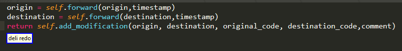


if you want find out more you can find more information [here](./Operations.md). 

As far as `ARGUMENT_LIKE_INFORMATION` is concerned,

```python
ARGUMENT_LIKE_INFORMATION = "(argument <argument_index>|keyword <keyword_index>|keyword value <keyword_value_index>|entire keyword <entire_keyword_index>|<caller> [<sub_index>]|entire call)"
```

This is where you specify which part of the function call you wish to select. For the 0.0.x versions the syntax used to be limited to `argument <argument_index>`   but as you can see there are currently more options.
We are going to explore  them [later](#Selectable). 

The important thing to note is that argument queries come in five formats, each providing you with a different way to specify which function call you want to extract information from. Choose which ever is the most suitable in each case and keep in mind there may be more than one ways of achieving the same result! We will go briefly over each of these five posibilities, clarifying all the parameters and give you an idea of how they work. 

What you should also keep in mind is that they in general search for results in a single logical line. For cases 1,3,4,5 that is the current line whereas for case 2 that is the line you indirectly specify with 

```python
"<vertical_direction> [<ndir>]"
```


# Positional descriptions

Firstly we are going to go through all the available methods to describe the function call you are interested in.
For simplicity, we will only be using `argument <argument_index>` instead of `ARGUMENT_LIKE_INFORMATION` for the time being!

## Searching the current logical line 

### No description at all

The most simple command is 

```python
"[smart] argument <argument_index>"
```
argument_index is an integer

```python 
IntegerRefST("argument_index", 1, 10),
```
specifying which argument you want to select.

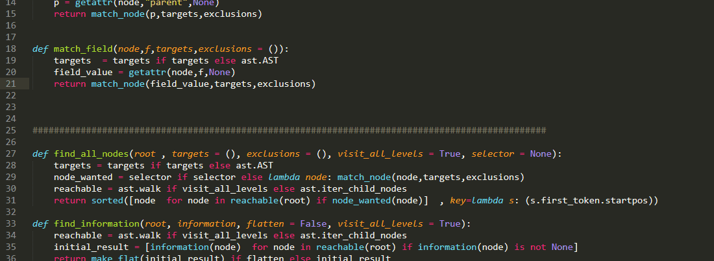

There are of course a couple of things to note:

* your selection does not have to be inside a function call to get a result. Remember the whole line is searched!

* as with most queries alternatives will (if any found) be offered!

* take a bit of care when you6 have selected whole regions of text insted of a single point

* regions nearer your selection in the AST will get prioritized!

To illustrate all of the above :


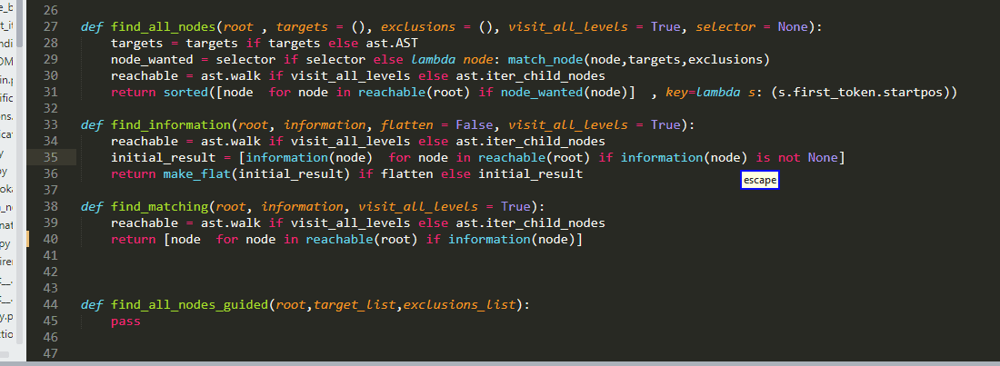

### Nth Adjective

But what if you want to have more control over what you select?  In that case you might need to use an nth/ordinal adjective as a positional descriptor as well. This is done by 

```python
"nth"
```

Which can take the following values:

```python
"first"
"second"
"third"
"fourth"
"fifth"
"sixth"
"seventh"
"eighth"
"ninth"
"last"
"second last"
"third last"
"fourth last"
```

specifying from which function call we want to select an argument:

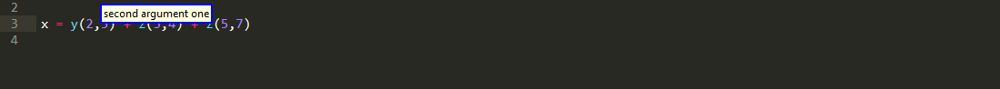

Of course that was a trivial example and code can be much, much more complicated with lots of nested functions calls, brackets etc. The combinations of code structure, selection location and desired targets are literally dozens...

Just as an example, you might want the second call from the outermost level, the second relative to the selection from the current nested level, the second leftmost lexically appearing, the second within the list or tuple, or something matching any of the above criteria but inside your highlighted selection,etc... 

To deal with this issue without overloading you with too many rules to learn :), some designs decisions were made  >and the plugin tries to interpret your adjective description in a variety of ways:

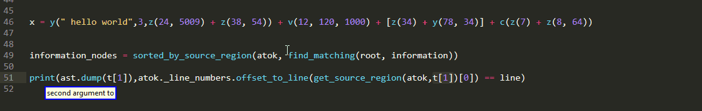

The way this works is a little bit complicated but I hope you get the main idea.

## Searching other lines with up and down: Vertical directions
 
What if you want to select something in a different line? Then you can use :

```python
"[smart] <vertical_direction> [<ndir>] [<nth>] argument <argument_index>"
```  

vertical_direction can belong to one of the two following families,as the name suggests enables you to specify whether you want something that is above or below your current cursor position.

```python
"(up|sauce|above)":"upwards",

"(down|dunce|below)":"downwards",
```

and ndir is an interger specifying how many "interesting"(!) lines relative to the current line up or down your roi is. if omitted it has a default value of one

```python
defaults = {
    "ndir":1,
}
```

please do pay attention to the whole "interesting" thing!Unlike say Caster navigation rules of the form:

```python
"sauce/dunce [<n>]"
```
we only count (physical) lines containing function calls! The following example should clarify this:

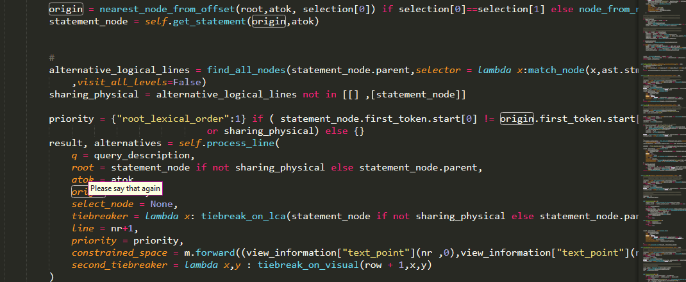

Though if we want to be more precise, we count lines that contain the beginning of function calls! this is important because logical lines can extend over multiple "physical" lines. The last example in the gif contains such an example,but to give you a better idea:

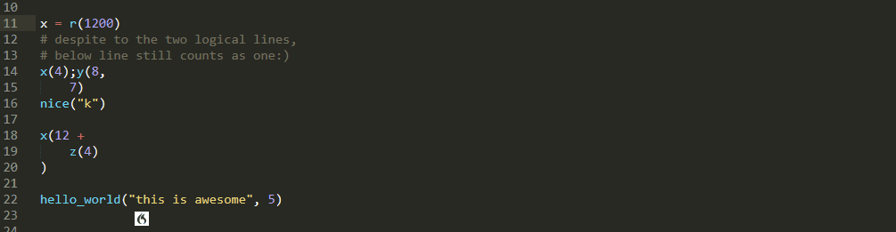

so you can see that

* physical lines still determine the line to which above/below refer  

* result and  alternatives from that physical line are  being prioritized, but 

* The whole logical line is scanned for alternatives ! 


### handling edge cases

In a more complex scenario, if there are multiple functional calls in the physical line and you up for using an ordinal adjective, in order to to preserve sanity, the main result will be decided by taking into consideration the order of lexical appearance:

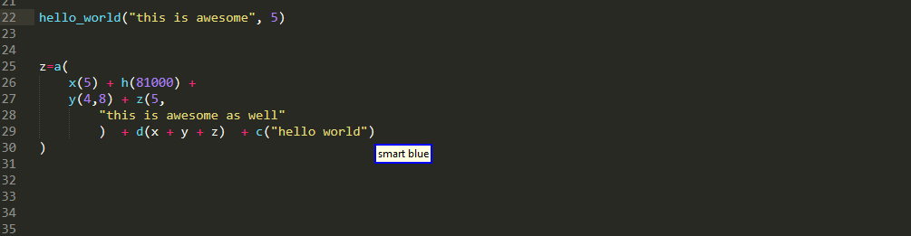


Finally, even though the argument query was originally designed to operate on a single logical line, make things more consistent, an exception was made for the case when the physical line that you are targeting contains more than one logical lines. In such a case, all the logical lines are processed in the monitor similar to the previous case, with important distinction that both the result and the alternatives must come from this physical line, where as in the previous case either one of them can come from other physical lines, if no suitable candidate is found.

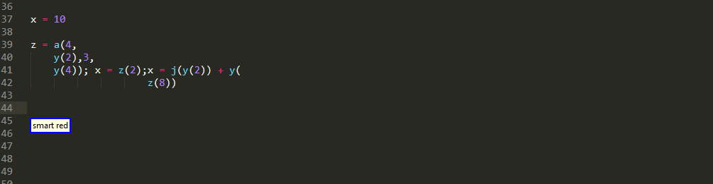


## Nested function calls: Inside keyword

Now let's see something different:

### Inside basics

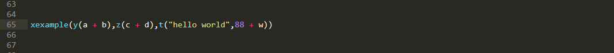

### Nth adjective before inside

in this example we use the command:

```python
"[smart] [<nth>] inside [<level_index>]  argument <argument_index>"
```
For the time being, the only available option for the level parameter is by means of the keyword inside , we can specify that we want an argument from a function call that is nested inside another function call! 

The level_index parameter specifies the index of the argument of the outer  function call our desired ROI lies in. if it is omitted, any match will be accepted. In order to specify which outer function call we are referring to, we can optionally use an nth adjective :

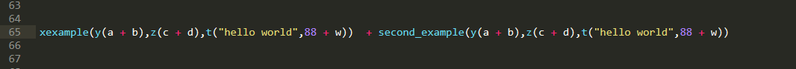


### Nth adjective after inside

This, looks very similar to the previous one. However, instead of using the nth adjective specify the outer function call, we use it to specify which one from the nested ones we want:

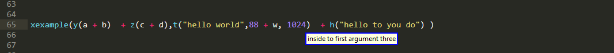

As you can see, the syntax looks like:

```python
"[smart] inside [<level_index>] <nth> argument <argument_index>"
```


## Nested function calls: Outer Keyword

this final rule was added in version 0.1.0 even though and more minimal version of it was one of the first rules I experimented with when this project was still just a proof of concept. 

```python
"[smart] outer [<level_index>] [<nth>] argument <argument_index>"
```

the motivation for such a rule is to enable you to handle scenarios, when you have multiple nested calls and and you want an argument from a call that is higher in the hierarchy. For example


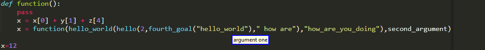

as you can see, `level_index` names you to specify how many function calls towards the outside you wish to climb up. if none is specified, the plug-in will yield results from the outermost one. please note that, alternatives can be offered from the other function calls as well.


furthermore, by making use of the nth adjective, you can pick up other function calls that are at the same nested level as the one specified. Compare the following cases:

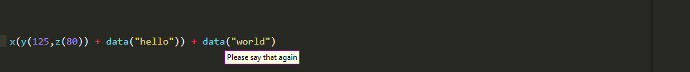

## Using the alternatives: A colorful approach

Consider the following example: 

- you want to grab an argument from the function call but for some reason is impractical to describe it positionally with argument queries alone

- You decide to use a query of another type ( for example a [BigROI](SelectBigROI.md) query) so that you can select a bigger region contains the function call with the intent 

- Unfortunately, this bigger region does not end up as the main result of the query but is suggested as a color highlighted alternative instead

How do you proceed? With what we have seen so far, to achieve this you need 2 steps

- select the corresponding alternative, with something like `smart red`

- then use a classical argument query

for a total of 3 commands, which is kind of wasteful. To address this issue release 0.2.0 introduced the ability to specify that ***you are interested in an argument that lies inside one of those alternatives*** via commands of the form

```python
"<color> [<nth>] argument <argument_index>" 
```

where color describes the alternative you want and can take one of the following values

```python
"blue"
"red"
"green"
"yellow"
"orange"
```

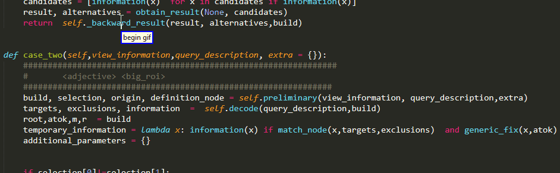

(Technically you can also use `"main"` as a color to specify you want something from the main result, but for the time being ignore this)


### Color And Inside

`color_argument_inside`


## Function calls in areas of other type: Small blocks

```python
"[<operation>] <small_block> [<nth>] " + ARGUMENT_LIKE_INFORMATION
```


# Selectable


As was previously mentioned, with release 0.1.0 this type of query seen an expansion regarding what users can select from a functional call using it

```python
"(argument <argument_index>|keyword <keyword_index>|keyword value <keyword_value_index>|entire keyword <entire_keyword_index>|<caller> [<sub_index>]|entire call)"
```

## Arguments Classic


### Argument Zero 

I believe that by now you probably already have guessed what `argument <argument_index>` does:) So no need to go through that again. 


However, what we haven't seen so far is how can we navigate to the argument section of a function call that currently has no arguments.  

A solution to this problem introduced in 0.1.0 and I believe a natural sounding one is to include 0 in the range of values for the `argument_index` 

```python
IntegerRefST("argument_index", 0, 10), 
```

and use that to perform this task. 

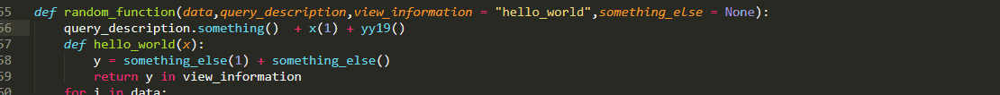


### Negative indices

With release 0.2.0 you can also use negative indices to pick up arguments from the end in a pythonic style


## Caller / Calling Function

One important feature that was missing from older versions and the first  expansion I implemented is the ability to select the caller/calling function. This corresponds to 

```python
"<caller> [<sub_index>]"
```

where `<caller>` is simply the word wrapped up as a choice (purely for technical reasons)

```python
Choice("caller",{
            "caller": "caller",
            }
        ),
```

### Empty Caller

as you might quickly notice , is followed by `<sub_index>` which is of course an integer like all indices and is also optional unlike all the other indices you see above. If you omitt it, vein the entire caller is selected, whereas by including it, you are able to sub index the calling function and to select only a small part of it.

### Or pieces of it

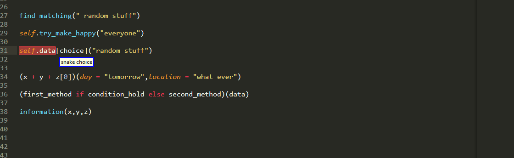

## Keyword  Arguments

### Keyword Name Only

So great, we have seen that we can select arguments whether passed positionally or by keyword. but in the latter case, there is also one important bit, namely the the name of the keyword parameter! using

```python
"keyword <keyword_index>"
```

we can select that as well!

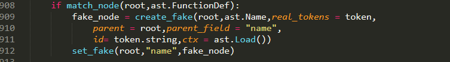


### Keyword Value Only

A natural continuation of selecting keyword names is to provide functionality for the values for keyword passed parameters. This is achievable via

```python
"keyword value <keyword_value_index>"
```

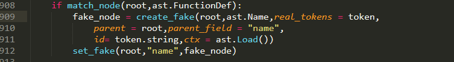

as you can see in the example , there is some overlap with  the vanilla `argument <argument_index>` but but it can still be time-saving/reducing cognitive load in many cases, instead of counting over the arguments up to the one you want, you are only counting those that are passed via keyword parameter.

### Entire Keyword 

Finally, given that you can pick up keyword names and values separately, it would be a shame if you could not select the whole thing, that is both the keyword name and the keyword value. For such occasions

```python
"entire keyword <entire_keyword_index>"
```

is your friend!


## Entire Call 

Last but not least, if you want the entire function call 

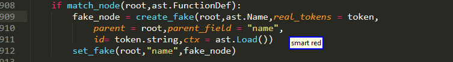


```python
"entire call"
```

will do the job for you:)


# Notes for users of previous versions(pre 0.1.0)

## Nth vs adjective 

"nth" corresponds to what used to be "adjective",but has been seen in order to be closer to what their grammars use for ordinal adjectives and make things easier for newcomers to understand.


## Up,Down vs Below,Above


In the past the keywords up and above used to have different semantics, but with 0.1.0 this has changed, we for keywords up/sauce having now the same meaning with above. This was done so us to make things more compatible with what users might be from other grammars, and either way,judging from the personal uses of my tool,up was used nowhere near as often as below/above.


# Full specification

```python
{
	"[(smart|<operation>)] [<nth>] " + ARGUMENT_LIKE_INFORMATION:
	    lazy_value("argument",1),
	"[(smart|<operation>)] (this|<vertical_direction> [<ndir>]) [<nth>] " + ARGUMENT_LIKE_INFORMATION:
	    lazy_value("argument",2),
	"[(smart|<operation>)] [<nth>] inside [<level_index>] " + ARGUMENT_LIKE_INFORMATION: 
	    lazy_value("argument",3),
	"[(smart|<operation>)] inside [<level_index>] <nth> " + ARGUMENT_LIKE_INFORMATION: 
	    lazy_value("argument",4),
	"[(smart|<operation>)] outer [<level_index>] [<nth>] " + ARGUMENT_LIKE_INFORMATION: 
	    lazy_value("argument",5),
	"[<operation>] <color> [<nth>] " + ARGUMENT_LIKE_INFORMATION: 
	    lazy_value("argument",6),
	configuration["color_argument_inside"] and "[<operation>] <color> inside [<level_index>] <nth> " + ARGUMENT_LIKE_INFORMATION: 
	    lazy_value("argument",7),
	configuration["color_argument_inside"] and "[<operation>] <color> [<nth>] inside [<level_index>] " + ARGUMENT_LIKE_INFORMATION: 
	    lazy_value("argument",8),
	"[<operation>] <small_block> [<nth>] " + ARGUMENT_LIKE_INFORMATION: 
	    lazy_value("argument",9),
}
```
