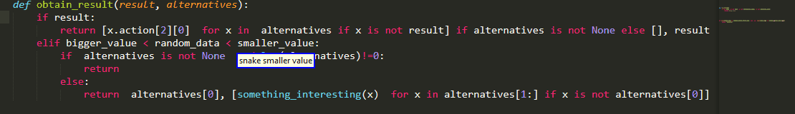
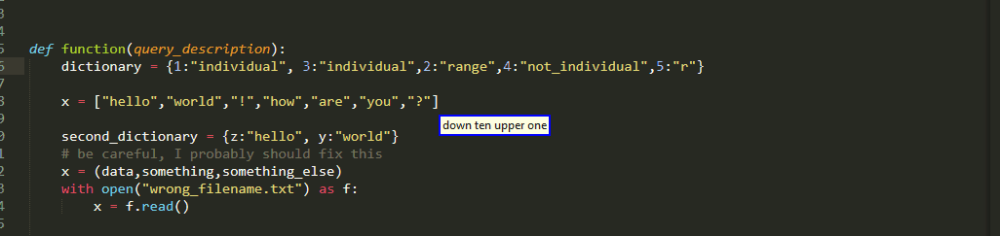
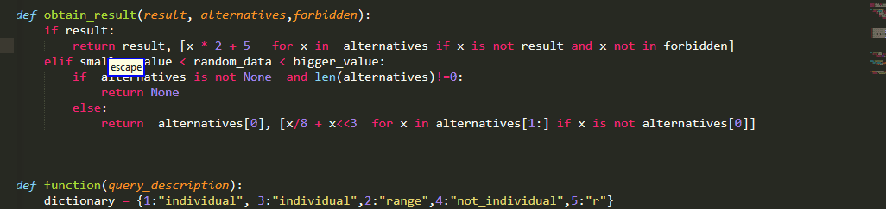
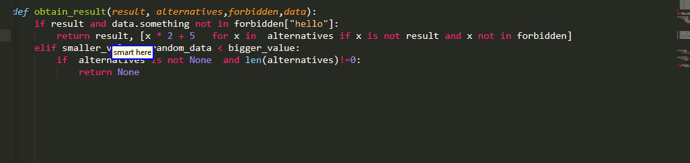
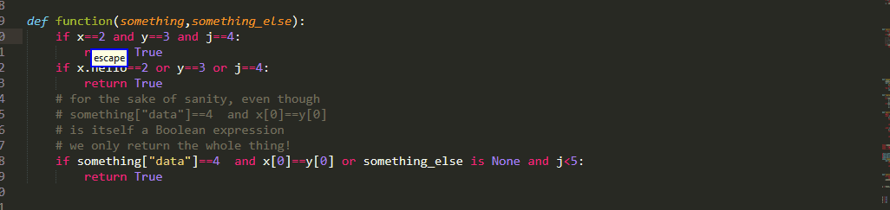
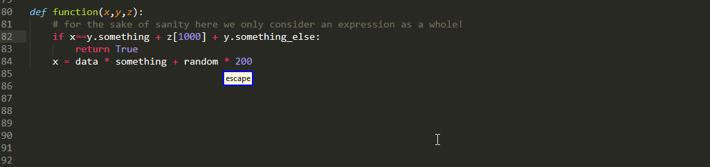

# Select Big Region of Interest Command

These commands are responsible for selecting "big" regions of interest. By "big" we refer to things like "if condition" or "assignment right" in contrast to say the first entry of a dictionary, though we will see later, by means of subindexes we can select [smaller stuff!](./SubIndexing.md)


## Contents

<!-- MarkdownTOC  autolink="true"  -->

- [Introduction](#introduction)
- [Case one](#case-one)
- [Case two: Nth Adjective](#case-two-nth-adjective)
- [Case three: Vertical Description](#case-three-vertical-description)
- [Case four: Vertical Block And Nth Adjective](#case-four-vertical-block-and-nth-adjective)
- [Selectable](#selectable)
    - [Assignment And Expression Statements](#assignment-and-expression-statements)
    - [If conditions While loops With clauses](#if-conditions-while-loops-with-clauses)
    - [If expressions](#if-expressions)
    - [Return Value](#return-value)
    - [Iterator  and Iterable](#iterator-and-iterable)
    - [Comprehensions](#comprehensions)
    - [Exception Handling](#exception-handling)
    - [Assertions And Exceptions Raising](#assertions-and-exceptions-raising)
    - [Functional Definitions](#functional-definitions)
    - [Class Definitions](#class-definitions)
    - [Import](#import)
    - [Lambda](#lambda)
    - [Continue Break Pass](#continue-break-pass)
    - [Experimental Same](#experimental-same)
    - [Temporary Until Small Regions](#temporary-until-small-regions)
        - [Disclaimer](#disclaimer)
        - [Literals](#literals)
        - [Subscripts  and Attribute](#subscripts-and-attribute)
        - [Comparisons Arithmetical And Boolean Operations](#comparisons-arithmetical-and-boolean-operations)
        - [More On Comparisons](#more-on-comparisons)
        - [More On Boolean](#more-on-boolean)
        - [More On Arithmetic](#more-on-arithmetic)

<!-- /MarkdownTOC -->


## Introduction

Regarding the available big regions of interest, you can find more details [below](#Selectable) , but I hope most of them are sufficiently self-explanatory.  Now if for any reason you do not like the names I have given, you can always customize as you see fit. Remember only change the spoken part, that is the key of each key value pair , so as not to break the plug-in backened! 


```python
Choice("big_roi",{

                "if condition" : "if condition",
                "else if condition" : "else if condition",
                "while condition" : "while condition",
                "with item" : "with clause",

                "exception":"exception",
                "exception name":"exception name",
                "handler":"handler",

                "if expression condition" : "if expression condition",
                "if expression value" : "if expression body",
                "if expression":"if expression",
                "if expression else" : "if expression else",

                "comprehension condition" : "comprehension condition",
                "comprehension value" : "comprehension value",

                "return value" : "return value",
                "pass":"pass",
                "break" : "break",
                "continue" : "continue",

                "assertion message" : "assertion message",
                "assertion condition" : "assertion condition",
                "exception raised" : "exception raised",
                "raised cause": "raised cause",

                "(assignment right| right)" : "assignment right",
                "(assignment left| left)" : "assignment left",
                "assignment [full]" : "assignment full",
                "(expression statement|expression)" : "expression statement",


                "import statement":"import statement",
                "import value" : "import value",
                "module" : "import module",
                
                

                "iterator" : "iterator",
                "iterable" : "iterable",

                "function name": "definition name",
                "function parameter": "definition parameter",
                "parameter list": "definition parameter list",
                "default value": "default value",
                

                "lambda":"lambda",
                "lambda body":"lambda body",

                
                "class name": "class name",
                "decorator":"decorator",
                "base class":"base class",

                # "same":"same",

    }
)
```

As a final note,there is also a commented line and an entire commented block(not shown here) separated by an empty line, about which we are going to talk [later](#experimental-same)  and [later](#temporary-until-small-regions) respectively.

Moving on the full syntax, looks like

```python
"(smart|<operation>) <big_roi> [<sub_index>]"

"[(smart|<operation>)] <nth> <big_roi> [<sub_index>]"

"[(smart|<operation>)] <vertical_direction> [<ndir>] <big_roi> [<sub_index>]"

"[smart] <vertical_direction> [<ndir>] <block> [<nth>] <big_roi> [<sub_index>]"

```


As with the other selection queries,  the whole "operation" thing you see at the start of each command, is not really a part of the big ROI queries themselves but rather a prefix , which causes some action to be taken with the result of the query instead of selecting it and can accompany virtually all selection queries in general. 


Please note that in the fourth case, this prefix is missing. If you wish, nothing stops you from editing the definition to match the other three rules, I just chose it not to include by default because I fear it might make the spoken queries too long and unnecessarily increase grammar complexity.


There are four syntaxes for you to specify the location of those regions of interest:


```python 
"smart <big_roi> [<sub_index>]"

"[smart] <nth> <big_roi> [<sub_index>]"

"[smart] <vertical_direction> [<ndir>] <big_roi> [<sub_index>]"

"[smart] <vertical_direction> [<ndir>] <block> [<nth>] <big_roi> [<sub_index>]"
```


now you might also notice that there is a common optional suffix `[<sub_index>]`

If it is omitted, then the entire region of interest will be selected, whereas if it is included, the region would be sub indexed and only a part of it will be selected. It is important to note that that the sub indexing has no effect on the way your description of the location is [interpreted](#) 


# Case one 

Ok lets start with the simple one, namely queries of the form: 

```python 
"smart <big_roi>"
``` 

As you might expect, the plugin will try to find matches to big roi description , prioritizing ones "nearer" in the AST with respect to the current selection. Some random examples:


One thing that is really important to note and is not made clear by the above gif, is what region are these queries  actually searching in order to retrieve results and alternatives? 

* a select few are always searching the entire code, for instance `import statement` or `class name` 

* most of them behave in their little bit more "contained" manner 

	- if invoked from the global scope the entire code will be searched, prioritizing things that are global in scope but providing alternatives that are inside functions as well.

	- If you invoked from inside say a function, then only that function will be searched

To illustrate this:


# Case two: Nth Adjective 

If you will have a little bit more control over what select, one of the ways to achieve that is through the command

```python 
"[smart] <nth> <big_roi> [<big_roi_sub_index>]"
```

where nth is an ordinal nth adjective and can take the following values

```python
"first"             "second"
"third"             "fourth"
"fifth"             "sixth"
"seventh"           "eighth"
"ninth"             "last"
"second last"       "third last"
"fourth last"
```

As a first remark, their region searched is the same with case one,and for most queries that means the current function( pay attention to my last example where alternatives are only offered from the nested function definition!)


Please also note that the plug-in is going to try a variety of ways to interpret this adjective. I hope the below example might give you a hint about the heuristics employed:

 


# Case three: Vertical Description

Another,more preferable for short distances if you ask me, alternative you can use is to provide information about the relative vertical position of your ROI with a command like that:

```python
"[smart] <vertical_direction> [<ndir>] <big_roi> [<sub_index>]"
```

vertical_direction can belong to one of the two following families and as the name suggests enables you to specify whether you want something that is above or below your current cursor position.

```python
"(up|sauce|above)":"upwards"

"(down|dunce|below)":"downwards"
```

and ndir is an interger specifying how many "interesting"(!) lines relative to the current line up or down your roi is. if omitted it has a default value of one

```python
defaults = {
    "ndir":1,
}
```

As an example:


A very important detail is that these types of queries are not limited to searching only the current function like the nth adjective ones or the ones from the first case! 


# Case four: Vertical Block And Nth Adjective


This variant combines vertical and positional order information. 

```python
"[smart] <vertical_direction> [<ndir>] <block> [<nth>] <big_roi> [<sub_index>]"
```
For the time being there is only one option available:

```python 
Choice("block",{ 
		"(function|functions)" :"function",
	 } 
),
```

So essentially, we can specify a function using a relative vertical desciption with the above/below keywords!

```python 
"<vertical_direction> [<ndir>] <block>"
```


Once we have established which function we are to search, the command will then work more or less like cases one and two

```python
"[<nth>] <big_roi> [<sub_index>]"
```

 but will search inside that function!


# Selectable


### Assignment And Expression Statements

Probably one of the most basic examples and one of the most frequently used ones as well

```python
"(assignment right| right)" 
"(assignment left| left)" 
"assignment [full]" 
"(expression statement|expression)" 
```


and because I forgot one rather important case


### If conditions While loops With clauses

```python
"if condition" 
"else if condition" 
"while condition" 
"with item" 
```


### If expressions

```python
"if expression"
"if expression condition" 
"if expression value" 
"if expression else" 
```


### Return Value

```python
"return value" 
```
 
Please note 

* that empty return values can be selected and must be taken into account when counting `ndir`

* `yield` is also covered under this case


### Iterator  and Iterable

```python
"iterator" 
"iterable" 
```


### Comprehensions

```python
"comprehension condition" 
"comprehension value" 
```


### Exception Handling

```python
"exception"
"exception name"
"handler"
```


Please note that empty handlers are supported as well and that some examples with some indexing are included.

### Assertions And Exceptions Raising

```python
"assertion message" 
"assertion condition" 

"exception raised" 
"raised cause"
```


### Functional Definitions

```python
"function name"
"function parameter"
"default value"
"parameter list"
```


### Class Definitions

```python
"class name"
"decorator"
"base class"
```


### Import 

```python
"import statement"
"import value" 
"module" 
```


please do pay attention, the sub indexing import statement has the same effect as import  value!

### Lambda

```python
"lambda"
"lambda body"
```


please do pay attention, the sub indexing Lambda has the same effect as Lambda Body!

### Continue Break Pass

Nothing really special about them, mostly there for the sake of completeness!

```python
"pass":"pass",
"break" : "break",
"continue" : "continue",
```


### Experimental Same

Now this something that probably should be official in the 0.1.0 release but eventually I chose not to. regardless of these decision I believe it is something that might be worth giving a try , simply uncomment the corresponding line

```python
# "same":"same",
```

what is the core idea? when you use `same`, the queries going to behave as if the type  of big region of interest specified was the same as there one from the last big ROI query executed! These can sometimes be handy as it is one word and can allow some tricks





### Temporary Until Small Regions

#### Disclaimer

What follows has a nearly one hundred percent chance of getting removed in the future :)

One of the weaknesses of the 0.1.0 release is that it does not include support for small regions via dedicated commands so in order to extract them, currently you need to use sub indexing. This of course is not always satisfying and in certain cases can even be very annoying (for instance when editing json file). As a temporary solution so that you have something to get by until release 0.2.0 introduces small regions of interest properly , various regions have been added as Big Roi 


```python
"string" : "string",
"integer literal" : "integer literal",
"dictionary" : "dictionary",
"list" : "list",
"tuple" : "tuple",
"set" : "set",


"subscript" : "subscript",
"subscript body" : "subscript body",
"key" : "key",
"lower" : "lower",
"upper" : "upper",
"step" : "step",

"attribute" : "attribute",

"comparison" : "comparison",
"arithmetic" : "arithmetic",
"boolean" : "boolean",

"member": "member",
"container": "container",
"membership" : "membership",

"left side" : "left side",
"right side" : "right side",
"middle" : "middle",

"arithmetic left"  : "arithmetic left" ,
"arithmetic right" : "arithmetic right",
"arithmetic middle" : "arithmetic middle",

"boolean left" : "boolean left",
"boolean right" : "boolean right",
"boolean middle" : "boolean middle",

"boolean and"  : "boolean and" ,
"boolean or" : "boolean or",

```

A few very important things to note

- The way they work with  nth adjectives might feel even more clumsy than usual, but this is only temporary. 

- The search in the way the ordinal adjectives are decoded is function wide!

- They can still be subindexed which can enable you to go deeper than otherwise possible in a single go! 

- Take care with nested hierarchies!

In the following we are going to quickly go through these regions but not in great detail because they are either way immature, highly likely subject to future change, they lack for the time being there dedicated commands and there are technicalities with some of them! But I hope you get the main idea

#### Literals

We start with the most basic stuff namely literals!


```python
"string" : "string",
"integer literal" : "integer literal",
"dictionary" : "dictionary",
"list" : "list",
"tuple" : "tuple",
"set" : "set",
```



#### Subscripts  and Attribute

I hope most of them are self-explanatory, load to be honest I'm not really that satisfied with `subscript body`
and perhaps using `index` instead of `key` might also be an alternative to consider

```python
"attribute" : "attribute",

"subscript" : "subscript",
"subscript body" : "subscript body",
"key" : "key",
"lower" : "lower",
"upper" : "upper",
"step" : "step"
```

there are some technicalities but I hope they do not disturb you too much!


#### Comparisons Arithmetical And Boolean Operations



```python
"comparison" : "comparison",
"arithmetic" : "arithmetic",
"boolean" : "boolean",
```

#### More On Comparisons

Now to have a little bit more fun, given thought in most cases comparisons typically have two or maybe three comparators, we also provide regions corresponding to the left medial or right side of such a comparison

```python
"left side" : "left side",
"right side" : "right side",
"middle" : "middle",
```

Which combined with sub indexing, enables you to go to levels deep within such a condition! now under the term comparison there are actually three things:

* The more traditional `==`,`<`,`>`,and so on

* The identity comparison `is`  and `is not`

* Checking if an item belongs to a sequence with the `in` and `not in` keywords

For the latter of the three, dedicated regions are provided in order to maximize ease of use and flexibility

```python
"member": "member",
"container": "container",
"membership" : "membership",
```

To visualize all of the above




#### More On Boolean

we can also get left middle right parts off a Boolean expression  or we can specify whether we are interested in operations using `and` or `or`

```python
"boolean left" : "boolean left",
"boolean right" : "boolean right",
"boolean middle" : "boolean middle",

"boolean and"  : "boolean and" ,
"boolean or" : "boolean or",
```





#### More On Arithmetic

As usual the left middle right pattern applies also to arithmetical operations

```python
"arithmetic left"  : "arithmetic left" ,
"arithmetic right" : "arithmetic right",
"arithmetic middle" : "arithmetic middle",
```




