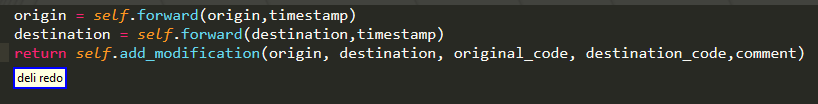

# Select Big Region of Interest Command

These commands are responsible for selecting "big" regions of interest. By "big" we refer to things like "if condition" or "assignment right" in contrast to say the first entry of a dictionary, though we will see later, by means of subindexes we can select [smaller stuff!](./SubIndexes.md)


Regarding the available big regions of interest, you can find more details [below](#Selectable) , but I hope most of them are sufficiently self-explanatory. Now before any reason you do not like the names I have given, you can always customize as you see fit. Remember only change the spoken part, that is the key of each key value pair , so as not to break the plug-in backened!


```python
Choice("big_roi",{

                "if condition" : "if condition",
                "else if condition" : "else if condition",
                "while condition" : "while condition",
                "with item" : "with clause",

                "exception":"exception",
                "exception name":"exception name",
                "handler":"handler",

                "if expression condition" : "if expression condition",
                "if expression value" : "if expression body",
                "if expression":"if expression",
                "if expression else" : "if expression else",

                "comprehension condition" : "comprehension condition",
                "comprehension value" : "comprehension value",

                "return value" : "return value",
                "pass":"pass",
                "break" : "break",
                "continue" : "continue",

                "assertion message" : "assertion message",
                "assertion condition" : "assertion condition",
                "exception raised" : "exception raised",
                "raised cause": "raised cause",

                "(assignment right| right)" : "assignment right",
                "(assignment left| left)" : "assignment left",
                "assignment [full]" : "assignment full",
                "(expression statement|expression)" : "expression statement",


                "import statement":"import statement",
                "import value" : "import value",
                "module" : "import module",
                
                

                "iterator" : "iterator",
                "iterable" : "iterable",

                "function name": "definition name",
                "function parameter": "definition parameter",
                "parameter list": "definition parameter list",
                "default value": "default value",
                

                "lambda":"lambda",
                "lambda body":"lambda body",

                
                "class name": "class name",
                "decorator":"decorator",
                "base class":"base class",

    }
)
```

now the full syntax, looks like

```python
"(smart|<operation>) <big_roi> [<sub_index>]"
"[(smart|<operation>)] <nth> <big_roi> [<sub_index>]"
"[(smart|<operation>)] <vertical_direction> [<ndir>] <big_roi> [<sub_index>]"
"[smart] <vertical_direction> [<ndir>] <block> [<nth>] <big_roi> [<sub_index>]"
```


As with the other selection queries,  the whole "operation" thing you see at the start of each command, is not really a part of the big ROI queries themselves but rather a prefix , which causes some action to be taken with the result of the query instead of selecting it and can accompany virtually all selection queries in general. as an example,



Please note that in the fourth case, this prefix is missing. If you wish, nothing stops you from editing the definition to match the other three rules, I just chose it not to enable by default because I fear it might make the spoken queries too long and unnecessarily increase grammar complexity.


There are four syntaxes for you find the location of those regions of interest:


```python 
"smart <big_roi> [<big_roi_sub_index>]"

"[smart] <nth> <big_roi> [<big_roi_sub_index>]"

"[smart] <vertical_direction> [<ndir>] <big_roi> [<big_roi_sub_index>]"

"[smart] <vertical_direction> [<ndir>] <block> [<nth>] <big_roi> [<big_roi_sub_index>]"
```


technically the rules you're going to see in my grammar bundles also have the prefix 

# Case one 

Ok lets start with the simple one, namely queries of the form: 

```python 
"smart <big_roi>"
``` 

As you might expect, the plugin will try to find matches to big roi description , prioritizing ones "nearer" in the AST with respect to the current selection.


it is also important to note that most queries search only within the current function.


# Case two 

another alternative are commands of the types:

```python 
"[smart] <nth> <big_roi> [<big_roi_sub_index>]"
```
you should probably be already familiar with adjectives, so here is an example of how you can use them:


as with case one, only the current function searched. ( pay attention to my last example where alternatives are only offered from the nested function definition!)


# Case three 

Another alternative you can use is to provide information about the relative vertical position of your ROI with a command like that:

```python
"[smart] <vertical_direction> [<ndir>] <big_roi> [<big_roi_sub_index>]"
```

vertical_direction can belong to one of the two following families and as the name suggests enables you to specify whether you want something that is above or below your current cursor position.

```python
"(up|sauce|above)":"upwards",

"(down|dunce|below)":"downwards",
```

and ndir is an interger specifying how many "interesting"(!) lines relative to the current line up or down your roi is. if omitted it has a default value of one

```python
defaults = {
    "ndir":1,
}
```

As an example:


Another important detail is that these types of queries are not limited to searching only the current function like the adjective ones! 


# Case four 


This variant combines vertical and positional order information. 

```python
"[smart] <vertical_direction> [<ndir>] <block> [<nth>] <big_roi> [<big_roi_sub_index>]"
```
For the time being there is only one option available:

```python 
Choice("block",{ 
		"(function|functions)" :"function",
	 } 
),
```

So essentially, we can specify a function using a relative vertical desciption with the above/below keywords!

```python 
"<vertical_direction> [<ndir>] <block>"
```


Once we have established which function we are to search, the command will then work more or less like cases one and two

```python
"[<nth>] <big_roi> [<big_roi_sub_index>]"
```

 but will search inside that function!


# Selectable


### Assignment And Expression Statements

probably one of the most basic examples and one of the most frequently used ones as well

```python
"(assignment right| right)" 
"(assignment left| left)" 
"assignment [full]" 
"(expression statement|expression)" 
```


and because I forgot one rather important case


### If conditions While loops With clauses

```python
"if condition" 
"else if condition" 
"while condition" 
"with item" 
```


### If expressions

```python
"if expression"
"if expression condition" 
"if expression value" 
"if expression else" 
```


### Return Value

```python
"return value" 
"pass"
"break" 
"continue" 
```


### Iterator  and Iterable

```python
"iterator" 
"iterable" 
```


### Comprehensions

```python
"comprehension condition" 
"comprehension value" 
```


### Exception Handling

```python
"exception"
"exception name"
"handler"
```


Please note that empty handlers are supported as well and that some examples with some indexing are included.

### Assertions And Exceptions Raising

```python
"assertion message" 
"assertion condition" 

"exception raised" 
"raised cause"
```


### Functional Definitions

```python
"function name"
"function parameter"
"default value"
"parameter list"
```


### Class Definitions

```python
"class name"
"decorator"
"base class"
```


### Import 

```python
"import statement"
"import value" 
"module" 
```


please do pay attention, the sub indexing import statement has the same effect as import  value!

### Lambda

```python
"lambda"
"lambda body"
```


please do pay attention, the sub indexing Lambda has the same effect as Lambda Body!

### Continue Break Pass

Nothing really special about them

```python
"lambda"
"lambda body"
```


