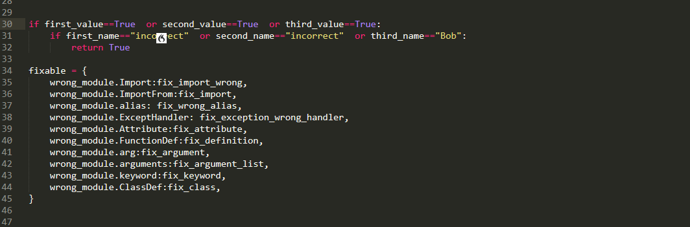
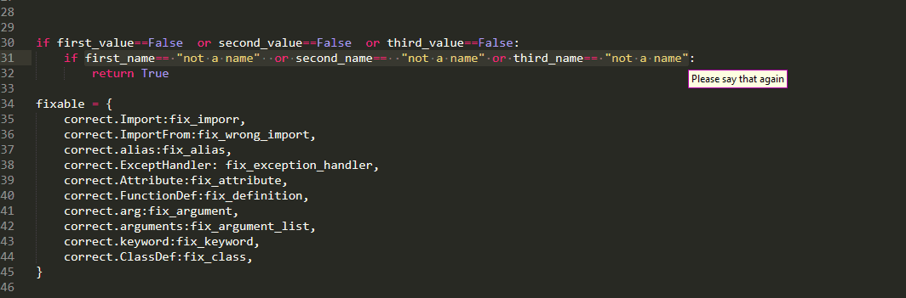
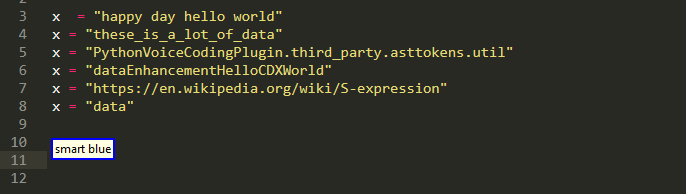
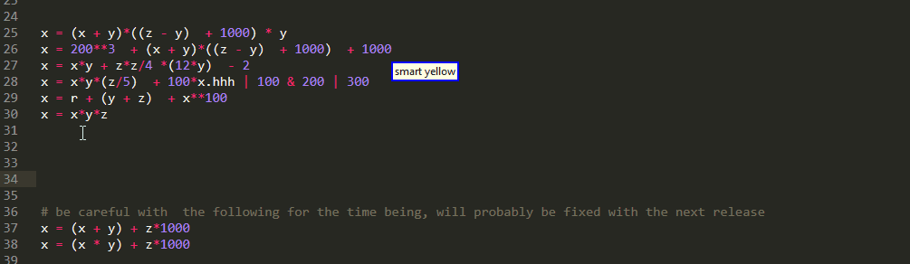

# SubIndexing 

Or the art of picking up smaller regions out of bigger ones!


The core idea behind it is that most regions of interest can be conceptually broken into smaller pieces which we can enumerate. By using that enumeration we can then describe which one we want using a unified,easy to speak and even more importantly easy to remember syntax.


Now there are two ways in which the sub indexing functionality becomes available to the end-user:

## Suffix Other Queries

If you have already taken a look at [Big Roi queries](./SelectBigROI.md) then you may have noticed that the old rules contained an optional suffix `[<sub_index>]` (which of course is an integer like all indices!)


```python
"(smart|<operation>) <big_roi> [<sub_index>]"
```

If this index is omitted, then the entire region of interest is selected. By including it in the command you can select only one of

* multiple targets in the left hand of an assignment

* multiple values of a  return  statement

* multiple dotted names of an attribute on the right side of an assignment

* multiple items of a list on the right side of an assignment

* multiple conditions that are connected with Boolean operations to form the if condition 


Similar functionality is also available for picking up parts of a `caller` when using [argument queries](./SelectArgument.md)

But of course, but when just one level deep, is not enough to handle a lot of cases. Furthermore, what if we have already somehow selected some region and want a piece of it? do we have described again? What if we can't? Also what happens even want an entire range of for the minor parts?

in order to provide an answer to all these important questions, release 0.1.0 has introduced another way to use sub indexing


## Dedicated Sub Indexing Commands

These queries operate on the current selection into support multiple cursors. The full syntax looks like

```python
"[(smart|<operation>)] [<nth>] part <sub_index>"

"[(smart|<operation>)] [<nth>] part <sub_index> until (<sub_index2>|the end)"

"[(smart|<operation>)] ([<nth>] any|any <nth2>) part <sub_index>"

"[(smart|<operation>)] ([<nth>] every|every <nth2>) part <sub_index>"
```

Stripping away the [operation prefix](./Operations.md) we obtain 


```python
"[smart] [<nth>] part <sub_index>"

"[smart] [<nth>] part <sub_index> until (<sub_index2>|the end)"

"[smart] ([<nth>] any|any <nth2>) part <sub_index>"

"[smart] ([<nth>] every|every <nth2>) part <sub_index>"
```


Now looking at those I hope some Bob turns are becoming visible

* all commands end with `part` followed by `<sub_index>` which is an integer (the only exception is case to where you have range but still the same spirit)

* Any nth adjective comes before `part` and as we will see later on, they also get applied before it does

* The first and second case are identical with the single exception of their suffix, as the second supports picking up an entire range. These are the commands that are to be used when you want to grab a single selection.

* The third and fourth command are identical with that single exception over the "any" vs "every" keyword used. these are the commands that are going to use where would we want to grab multiple selections/work with more than one things.

As a consequence, we are going to present side-by-side the first with the second and the third was the fourth, while highlighting their differences!

### Standalone Part


### Any And Every Part

```python
"[smart] ([<nth>] any|any <nth2>) part <sub_index>"

"[smart] ([<nth>] every|every <nth2>) part <sub_index>"
```

As mentioned previously, these are the queries you would like to use when you want to work with multiple things.
But what are the differences? to illustrate them, let's just start with some very simple queries without any adjectives.

Well as the name suggests,`every` grabs every item in multiple selection. this is useful when you want to edit all of them simultaneously




whereas, the `any` selects the first one and present the rest as alternatives. This is useful when you want to edit them sequentially




As illustrated above, you need to pay attention to how the various conditions are bound together
(or binds weaker causing it to be higher in the AST) in the can only select smaller conditions  from the outermost level!

This feature existed ever since the initial release but was only documented on 0.0.1 . This release also expanded the feature from applying only to ast.BoolOp nodes to encompass ast.Compare nodes as well! in plain English:

  

furthermore, big_roi_sub_index can make our lives easier even in cases like the one below:

  

where we want to play with the indexes of a subscript!

### new with 0.0.4

Sub indexing functionality has been expanded to include picking up parts of strings :

  

We can pick up parts from the URL, individual words or letters, or part of a camel or snake case. this feature is still immatur  and needs more work, but I am planning to improve and also expand it with the ability to select a whole range.

Also something that was kind of missing,you can now select a subset of an arithmetic expression :

  

Once again you need to pay attention to operator precedence and as you can see there are some edge cases that need to be fixed.

Finally, we clarify one more thing! What about relative vertical offsets when using above? We know that these abstract vertical keywords only count interesting lines, but what do we count as interesting here? To stay compatible with all of the above, we count all lines containing our desired big region of interest regardless of whether we can extract or not from them information with the sub index! As an example:

  


please note however that there are limitations  and sub indexes are more of a solution to make the simplest case faster
rather than a systematic way of handling complex code!
