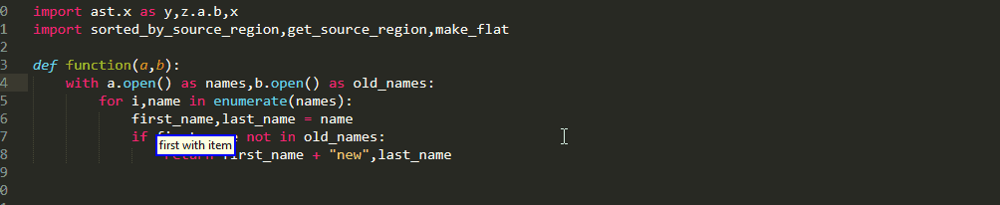
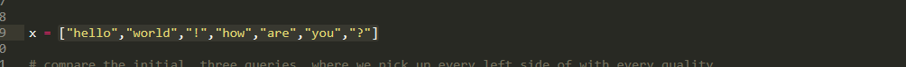
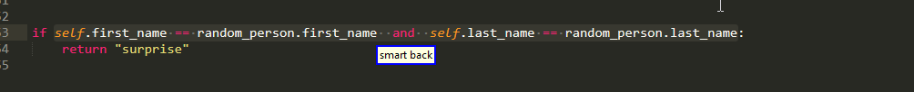
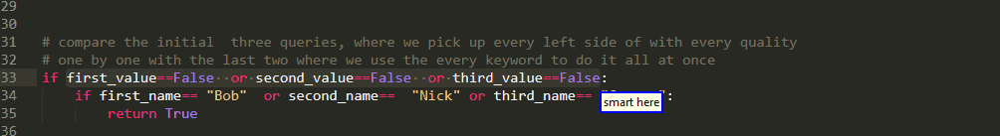
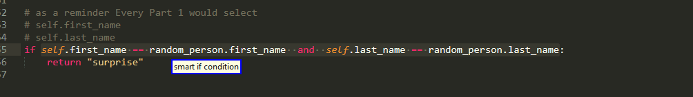
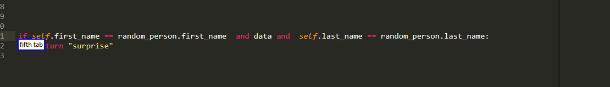
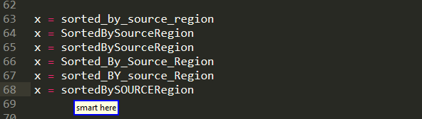
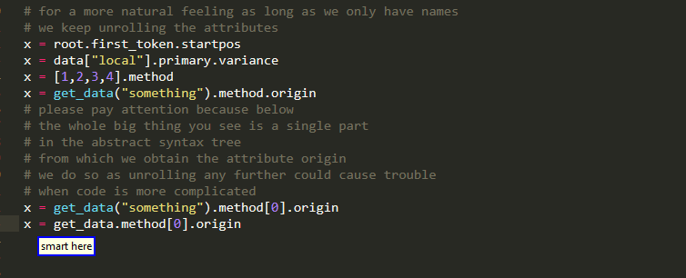

# SubIndexing 

Or the art of picking up smaller regions out of bigger ones!


The core idea behind it is that most regions of interest can be conceptually broken into smaller pieces which we can enumerate. By using that enumeration we can then describe which one we want using a unified,easy to speak and even more importantly easy to remember syntax.


you can find more information about what parts you can extract [below](#selectable).

Now there are two ways in which the sub indexing functionality becomes available to the end-user:

## Suffix Other Queries

If you have already taken a look at [Big Roi queries](./SelectBigROI.md) then you may have noticed that all the rules contained an optional suffix `[<sub_index>]` (which of course is an integer like all indices!)


```python
"(smart|<operation>) <big_roi> [<sub_index>]"
```

If this index is omitted, then the entire region of interest is selected. By including it in the command you can select only one of

* multiple targets in the left hand of an assignment

* multiple values of a  return  statement

* multiple dotted names of an attribute on the right side of an assignment

* multiple items of a list on the right side of an assignment

* multiple conditions that are connected with Boolean operations to form the if condition 



Similar functionality is also available for picking up parts of a `caller` when using [argument queries](./SelectArgument.md)

But of course, but going just one level deep, is not enough to handle a lot of cases. Furthermore, what if we have already somehow selected some region and want a piece of it? Do we have to describe it again? What if we can't? Also what happens when we want an entire range of for the minor parts?

In order to provide an answer to all these important questions, release 0.1.0 has introduced another way to use sub indexing


## Dedicated Sub Indexing Commands

These queries operate on the current selection  and  support multiple cursors. The full syntax looks like

```python
"[(smart|<operation>)] [<nth>] part <sub_index>"

"[(smart|<operation>)] [<nth>] part <sub_index> until (<sub_index2>|the end)"

"[(smart|<operation>)] ([<nth>] any|any <nth2>) part <sub_index>"

"[(smart|<operation>)] ([<nth>] every|every <nth2>) part <sub_index>"
```

Stripping away the [operation prefix](./Operations.md#Introduction-To-Prefix-Operations) we obtain 


```python
"[smart] [<nth>] part <sub_index>"

"[smart] [<nth>] part <sub_index> until (<sub_index2>|the end)"

"[smart] ([<nth>] any|any <nth2>) part [<sub_index>]"

"[smart] ([<nth>] every|every <nth2>) part [<sub_index>]"
```


Now looking at those I hope some patterns are becoming visible

* all commands end with `part` followed by `<sub_index>` which is an integer (Oneexception is case 2 where you have range  but still the same spirit)

* Any nth adjective comes before `part` and as we will see later on, they also get applied before it does

* The first and second case are identical with the single exception of their suffix, as the second supports picking up an entire range. These are the commands that are to be used when you want to grab a single selection.

* The third and fourth command are identical with that single exception over the "any" vs "every" keyword used. these are the commands that are going to use where would we want to grab multiple selections/work with more than one things.


As a consequence, we are going to present side-by-side the first with the second and the third was the fourth, while highlighting their differences!

### Standalone Part

#### Differences Between The Second And First Case

As should already probably be clear, the fundamental difference between the first and second syntaxes is that with the first you select one of the many pieces, whereas a second you can select an entire range,  in a single selection. to make things clear, consider the simplified case

```python
"part <sub_index>"

"part <sub_index> until (<sub_index2>|the end)"
```

and compare the two examples




#### Nth Adjective And Two Level Sub Indexing

by including the optional `<nth>` adjective, which as usual can take the following values

```python
"first"             "second"
"third"             "fourth"
"fifth"             "sixth"
"seventh"           "eighth"
"ninth"             "last"
"second last"       "third last"
"fourth last"
```

we can enable sub indexing to take place in two stages. In the first stage the provided ordinal adjective, extracts one of the smaller parts that make up the big gear all regional region, and then the remaining `"part <sub_index>"` is applied on the smaller part. To illustrate this




### Any And Every Part

#### Core Idea

```python
"[smart] ([<nth>] any|any <nth2>) part [<sub_index>]"

"[smart] ([<nth>] every|every <nth2>) part [<sub_index>]"
```

As mentioned previously, these are the queries you would like to use when you want to work with multiple things. but how exactly does it work? the core idea behind these two queries is that we first split the original region into all of the smaller ones that make it up and then we sub index each of them! to illustrate this:




#### Differences Between Any And Every Keywords

But what are the differences? to illustrate them, let's just start with some very simple queries without any adjectives.

Well as the name suggests,`every` grabs every item in multiple selection. this is useful when you want to edit all of them simultaneously


whereas, the `any` selects the first one and present the rest as alternatives. This is useful when you want to edit them sequentially


as alternatives persist when using [delete](./Operations.md#) or [edit](./Operations.md#)

#### Nth Adjective Order

With that hopefully sorted out we can move forward to discussing

```python
"([<nth>] any|any <nth2>)"

"([<nth>] every|every <nth2>)"
```

What is the difference between the nth adjective before/after that any/every keyword? as was previously mentioned, old descriptions are applied from left to right and as a consequence

* If there is an nth adjective before the any/every every keyword, then firstly the specified part is extracted from the original region and then the rest of the query applies on that smaller part! that means we extract from this smaller part all the even smaller parts that make it up and on each of them apply the `part <sub_index>` portion of the query. 


*  If there is an nth adjective before the any/every every keyword,  then from the original region first we extract all of it smaller regions and then the rest of the query including the nth adjective is applied on each of them!



#### Optional Index

Finally, one thing we should also note is that for these two queries, the `<sub_index>` is optional.

The reason behind this the decision is that if it is not optional, then you will only be able war on things that are at least two levels deep, which in certain cases could prove troublesome.

For example,


#### Empty Results

Now it may be the case but not every smaller part can be sub indexed the way you want. In those cases, where for instance you can't go deep enough, only the parts that are not empty are shown as a result/alternatives. To make this clear



## Selectable 

We have hopefully clarified the syntax and you have already probably seen some examples of what parts you can pickup from a selection. But it is time to go through them and lead to bead Maureen dictate

### Multiple Values

One common case and probably one  where sub indexing feels the most natural, is when we have multiple `,` separated values. 


### Name Nodes

Moving on to a case where there isn't always a proper delimiter like above. In particular , while variable names are represented as single tokens, they are often comprised by more than just one words,which are glued together via snake case or camel case or so on. With sub indexing you can pick up of those individual awards for many formats




And this is not limited to variable names, but is more general as you can see below


### Strings


  

We can pick up parts from the URL, individual words or letters, or part of a camel or snake case. despite being there since 0.0.4 and actually predating the above variable thing ,this feature is still imature  and needs more work!


### Boolean Operations

Furthermore, you can pick up the individual conditions that make up a Boolean expression. However, they are also a little bit tricky as you do need to pay attention to operator precedence!


In this example because `or` binds weaker than `and` , it is higher in the AST  and  so the two comparisons are viewed the single part. 


### Comparisons

Once you have selected a comparison, you can also pick up the various values the are being compared

  

As you can see in the above example,extracted from comparisons is not limited only to situations where there is just a left side and a right side but can handle more items. It is also not limited to standard arithmetical comparisons such as `==`,`<`, and so on but also covers cases where we  check if an item belongs to a container via the `in` keyword. 


### Arithmetic Expressions

And of course it would be a big shame if you couldn't have similar functionality for arithmetical expressions. However just like Boolean operations it is one of those linear vs tree view situations  and  once again you need to pay attention to operator precedence 

  

Unfortunately, as you can see ,there are some edge cases that need to be fixed.

### Attributes




### Subscript


### Forwarding Nodes


As illustrated above, you need to pay attention to how the various conditions are bound together
(or binds weaker causing it to be higher in the AST) in the can only select smaller conditions  from the outermost level!

This feature existed ever since the initial release but was only documented on 0.0.1 . This release also expanded the feature from applying only to ast.BoolOp nodes to encompass ast.Compare nodes as well! in plain English:

  

furthermore, big_roi_sub_index can make our lives easier even in cases like the one below:

  

where we want to play with the indexes of a subscript!

### new with 0.0.4

Sub indexing functionality has been expanded to include picking up parts of strings :

  

We can pick up parts from the URL, individual words or letters, or part of a camel or snake case. this feature is still immatur  and needs more work, but I am planning to improve and also expand it with the ability to select a whole range.

Also something that was kind of missing,you can now select a subset of an arithmetic expression :

  

Once again you need to pay attention to operator precedence and as you can see there are some edge cases that need to be fixed.

Finally, we clarify one more thing! What about relative vertical offsets when using above? We know that these abstract vertical keywords only count interesting lines, but what do we count as interesting here? To stay compatible with all of the above, we count all lines containing our desired big region of interest regardless of whether we can extract or not from them information with the sub index! As an example:

  


please note however that there are limitations  and sub indexes are more of a solution to make the simplest case faster
rather than a systematic way of handling complex code!
